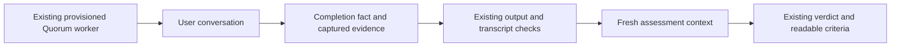

# A focused path from current Quorum

**Date:** 2026-09-07. **Source reviewed:** `8b2c2bda`.
**Disposition:** findings for discussion; no implementation or spec amendment.

Drew challenged the previous unified-evals review for turning a focused
Superpowers Evals improvement into another platform program. Four fresh-context
reviewers examined execution, conversation, measurement and architecture. Their
brief explicitly allowed keeping Quorum, rejected generic API support as a first
milestone, and required every proposed change to justify its immediate value.
The root traced the disputed paths, checked primary source and retained receipts,
and ran one small offline checker probe.

## Recommendation

**Keep Superpowers Evals and most of its execution machinery. Make one complete
run behave the way Drew wants before changing the orchestration around it.**

The first capability is a natural user conversation followed by independent
assessment of its transcript and output. It can execute inside the current
Quorum worker and existing appliance campaign container. Conversation, capture,
checks and assessment can remain sequential within that worker. Other workers
run concurrently. A separate grading queue, scheduler, service, credential
system or smevals migration is unnecessary for that proof.

For the eventual everyday batch path, simplify the existing campaign policy in
place. Keep useful ownership, per-attempt containers, source/config selection,
credential delivery and journal storage. Remove the requirement that ordinary
completed runs pass campaign-wide telemetry, timing, selected-block and sealing
rules before they become usable results. That is a coupled policy change, not
a one-line flag and not a reason to build another supervisor first.

This narrows the immediate recommendations in the
[previous review](2026-09-07-unified-evals-architecture-review.md). The reviewed
smevals design remains unchanged as a record of the proposal. Neither that
proposal nor this memo is an implementation mandate after Drew's steering.

## What the source changed our minds about

### Quorum already has the main execution assets

There are three paths, and conflating them exaggerated the replacement case:

| Path | Existing value | Actual limitation |
|---|---|---|
| Direct `run-all` | One global scheduler, per-endpoint caps/spacing, asynchronous per-run processes, result directories | Its matrix lacks per-cell revision/effort/repetition identity; it is not the complete appliance path |
| Phase 1 appliance job | Stable job ID, detach, polling, cancellation, credential projection, parallel runs with separate HOMEs | One harness/credential per job, one shared container and network namespace |
| Campaign appliance | Mixed configured arms, per-arm Superpowers refs/effort, repetitions, per-attempt containers, detached owner and exact stop identity | Completion and report inclusion are coupled to experiment-validity/replacement policy |

The direct scheduler really launches asynchronous work; synchronous setup in a
child does not serialize every run. The runner also has process-global state,
so retaining one run per process matters. References:
[scheduler](../../src/scheduler/index.ts:254),
[child invocation](../../src/run-all/index.ts:236),
[actual matrix-to-child mapping](../../src/run-all/index.ts:591).

The Phase 1 restriction is enforced in both request validation and credential
scope, not just a CLI guard. Its separate HOMEs and private tmux servers already
avoid configuration/session collisions. They do not isolate fixed localhost
ports: existing fixtures bind 3000 and 5173. Per-attempt containers have concrete
value for arbitrary concurrent scenarios, and the campaign already has them.
References: [selection restriction](../../src/appliance/cli.ts:411),
[fixed-port fixture](../../src/setup-helpers/triggering-fixtures.ts:78),
[campaign runtime](../../src/campaign/container-spawner.ts:512).

One active appliance-owned batch is enough. Many scenarios and configurations
can overlap inside it; concurrent submitted batches and multi-tenancy are not
requirements. The existing exclusive host claim can stay.

### Campaign policy is a real problem, but a pilot can use its transport

The retained campaign log records a run ending when synchronous publication
delayed a telemetry sampler in the same process. Another ended after telemetry
aged across Docker authorization callbacks. Later fixes narrowed those defects;
we did not reproduce their live incidence this turn. These are much more precise
findings than saying the whole refactor made everything slower.
See [campaign 3](2026-09-06-pr2258-five-model-campaign.md:217) and
[campaign 5](2026-09-06-pr2258-five-model-campaign.md:382).

Current source still requires positive block validity for normal completion,
and the report excludes outcomes without it. Setting zero reserves and one
attempt does not disable those rules. Removing only the stale-sample guard would
leave the state fold and report enforcing the same policy elsewhere.
References: [controller completion](../../src/campaign/controller.ts:982),
[state-fold completion](../../src/campaign/execution-state.ts:567),
[report inclusion](../../src/campaign/report.ts:113).

The runtime reviewer initially preferred retaining current campaign execution;
the architect preferred replacing its finite policy. The useful resolution was
to distinguish the first diagnostic from the durable product. The first changed
conversation can use current containers and scheduling. Its per-run assessment
can be inspected without claiming the current aggregate is the desired report.
After that proof, change controller policy, state-fold semantics and reporting
together. Keep journal transactions/leases and exact attempt lifecycle operations;
do not create a second store or emit fictional always-valid receipts.

This recommendation does not establish the size of that later edit. The next
plan should show a deletion-oriented change in the existing path. If it starts
by rebuilding ownership, credentials and container management, it has lost the
reuse advantage and should be reconsidered.

### The central new behavior belongs inside one run

Today Gauntlet receives a QA persona, the scenario's acceptance criteria and
evaluation instructions, then ends by reporting a quality verdict. A project
prompt is additive. Removing the AC text alone leaves the QA reminders, tools
and completion mechanism. Gauntlet's TUI also starts a shell; the model follows
a HOWTO to type the generated harness launcher. Those are concrete seams to
change, not a need for a generic runner interface.
References: [Gauntlet prompt construction](/Users/drewritter/prime-rad/gauntlet/src/agent/prompts.ts:59),
[TUI startup](/Users/drewritter/prime-rad/gauntlet/src/adapters/tui/adapter.ts:129),
[Quorum invocation](../../src/runner/index.ts:1963).

The small intended loop is:

Use the existing Gauntlet terminal transport/client/logger as the first candidate.
The runtime launches the already prepared harness. The user actor gets its brief,
screen/input tools, and scoped access to files actually presented to the user.
It does not get the private rubric or unrestricted internal-log/shell inspection.
Its finish action records an observed endpoint, including bad delivery or refusal.
The assessor then gets the rubric and relevant evidence in a fresh history, with
no controls for continuing the subject conversation. Both roles can use the same
configured model and credentials. Keep the run reservation until all work ends.

This must be a small explicit conversation path, not role conditionals scattered
through every branch of Gauntlet's QA loop. A separate conversation function over
its existing client/adapter/logger is acceptable if that is simpler than modifying
the QA loop. No arbitrary policy-plugin system is needed.

CSD remains an alternative for the interaction layer. It is not a drop-in win:
the inspected Claude launcher disables `AskUserQuestion`, and Codex preparation
writes a new config with low effort. Preserving the selected harness behavior
would require changes there too. Prefer the approach that demonstrates natural
questions, retained refusal text and the exact provisioned settings with less
code. Terminal viewport/idle inference remains an acknowledged weakness of the
Gauntlet candidate. References:
[Claude launch](/Users/drewritter/prime-rad/claude-session-driver/src/harness/claude.ts:92),
[Codex config](/Users/drewritter/prime-rad/claude-session-driver/src/harness/codex.ts:109).

Separate assessment improves the measurement boundary; it does not prove lower
cost or latency. It adds inference. Feed the evidence the chosen criteria need;
do not build a transcript-compression system or automatically refeed every log.

### Trustworthy results need small repairs, not a new evidence platform

Keep the existing composer, check records and expected-check manifest. They
already distinguish an ordinary failing post-check from missing/broken checking.
The checks manifest prevents silently omitted checks; it is distinct from the
campaign's whole-run artifact manifest and publication/sealing machinery.

Three bounded corrections are relevant to the first capability:

- Preserve message-bearing conversations with zero tool calls, and distinguish
  them from unavailable capture. Current code removes the trajectory and later
  gates also use tool count; changing only the writer is insufficient. Surface
  source parse failures rather than silently dropping them. The previous review's
  two saved offline probes demonstrate both capture problems.
- Record conversation completion separately from grading. A completed refusal or
  bad review stays completed if assessment fails. An assessor's `investigate`
  must not automatically become a pass, fail, or proof of subject non-completion.
- Retain Gauntlet's existing cited criterion results in Quorum's result/rendering.
  They already exist upstream; Quorum currently projects them away. Basic result
  rows and evidence links are sufficient, with requested/completed/error counts
  visible. Repeated runs need distinct rows, not an overwritten matrix cell.

References: [capture writer](../../src/capture/index.ts:296),
[capture gate](../../src/runner/index.ts:631),
[composer](../../src/composer.ts:55),
[discarded criteria](../../src/runner/index.ts:252),
[batch row key](../../src/cli/render-batch.ts:171).

The evals reviewer also found a concrete executable-check bug. Root reproduced it
against the current function with harmless child processes:

| Command outcome | Current `command-succeeds` result |
|---|---|
| Exit 0 | Pass |
| Exit 1 | Fail |
| Child shell terminates itself with SIGTERM | **Pass** |
| Missing command inside the shell | Ordinary fail |

The signal case follows directly from treating null exit status as zero at
[fs-verbs.ts:336](../../src/check/fs-verbs.ts:336). Repairing this result handling
is necessary before trusting the selected executable oracle. Preserve the
distinction between invalid subject output and a broken checker. This is a
local correctness issue, not justification for a general dependent-check engine.

## What I would do first, and what I would leave alone

**One immediate capability:** use a small pricing-bug scenario to prove a natural
clarification, a completed implementation or refusal, saved transcript/output,
and separate assessment against an independent checker. Reuse the existing tiny
JavaScript fixture; create a clearly named variant with no answer-revealing bug
comments. The private user fact can be the desired unknown-discount behavior.
If the opening explicitly asks the subject to confirm it, the test proves question
transport, not spontaneous requirements discovery.

The checker should exercise multiple prices and known/unknown codes, including
known wrong outputs and a broken-checker control. Subject-written tests are useful
evidence but are not the independent oracle. This first case needs no dependency
installation, browser, app server, Go project, exact historical approval graph or
child-agent causality model. The planted code-review fixture is a useful next
case, not another prerequisite.

First inspect one real interaction for each selected harness, then overlap copies
within a harness and across Claude/Codex using existing campaign credential routes.
That proves the path, not Superpowers treatment value or maximum safe capacity.
Eight/sixteen remain eventual measurements, and no numerical speedup is established
by this investigation. Any live run belongs to the later agreed implementation/run
work, not this source review.

I narrowed the reviewers' suggested work further:

| Keep now | Leave out of the first capability |
|---|---|
| Current prose/frontmatter scenario files; parsed brief/AC separation | New authoring DSL, generic API example, catalog conversion, optional-check authoring polish |
| Quorum provisioning, credentials, existing worker/container and conservative caps | Credential registry redesign, new quota controller, separate grader queue |
| One active appliance batch, existing status/cancel commands | New submission service, concurrent batch queue, mandatory CLI renaming |
| Existing checks, small needed capture fixes, criterion rows | General regrading service, artifact reconstruction for every scenario, new dashboard |
| First small conversation/output case | Go fixture repair, all-harness qualification, full SDD benchmark before the loop works |

The current story parser already separates `description` and `acceptanceCriteria`.
Use that seam before inventing `user.md` or a new task envelope. A selected scenario
can keep its existing setup/check files; making checks optional is a later authoring
convenience. Source:
[story parser](/Users/drewritter/prime-rad/gauntlet/src/format/story-card.ts:23).

For the durable product, the remaining substantial work is the finite-policy
simplification described above and presenting its requested run inventory in the
existing report. Those are follow-ups to evaluate after the first capability,
not parallel foundation projects that must all land before a useful run.

OAuth support is another conditional item. Phase 1 already projects OAuth files;
campaign attempts currently reject those auth kinds. Use the already supported
campaign routes for the initial proof. If a selected configuration needs OAuth,
reuse the existing projection; do not invent new login or credential infrastructure.
This keeps eventual harness coverage honest without making every route immediate.

## Corrections, uncertainty and evidence

The earlier review described direct run-all's limiter as a general first-429
abandonment rule. That was too broad: its callback recognizes the Antigravity Code
Assist marker specifically ([source](../../src/run-all/index.ts:843)). That behavior
does not justify generic rate-limit work for the Claude/Codex first slice.

We do not have a controlled old/new throughput comparison, a measured extraction
cost, or current installed/live qualification from this turn. The source supports
keeping existing concurrency and removing specific policy coupling; it does not
support promising that a language/framework change will make runs faster.

The four reports preserve details and alternative arguments:

- [Execution/runtime](/Users/drewritter/.codex/visualizations/2026/09/07/01a07cbc-47f5-70d0-803e-acdaff77da82/quorum-focused-review/execution.md)
- [Conversation/harnesses](/Users/drewritter/.codex/visualizations/2026/09/07/01a07cbc-47f5-70d0-803e-acdaff77da82/quorum-focused-review/conversation.md)
- [Eval methodology](/Users/drewritter/.codex/visualizations/2026/09/07/01a07cbc-47f5-70d0-803e-acdaff77da82/quorum-focused-review/measurement.md)
- [Architecture and alternatives](/Users/drewritter/.codex/visualizations/2026/09/07/01a07cbc-47f5-70d0-803e-acdaff77da82/quorum-focused-review/architecture.md)
- [Checker probe](/Users/drewritter/.codex/visualizations/2026/09/07/01a07cbc-47f5-70d0-803e-acdaff77da82/quorum-focused-review/checker-probe.ts) and [observed output](/Users/drewritter/.codex/visualizations/2026/09/07/01a07cbc-47f5-70d0-803e-acdaff77da82/quorum-focused-review/checker-probe.stdout.jsonl)

Supporting paths are local research artifacts, not portable runtime dependencies.
Gauntlet was inspected at `588a81e8`, CSD at `e608d693`; selected smevals sources
remain the pinned checkouts cited in the architecture report. No production code,
spec, credential, appliance or deployment was changed; no provider was called.
