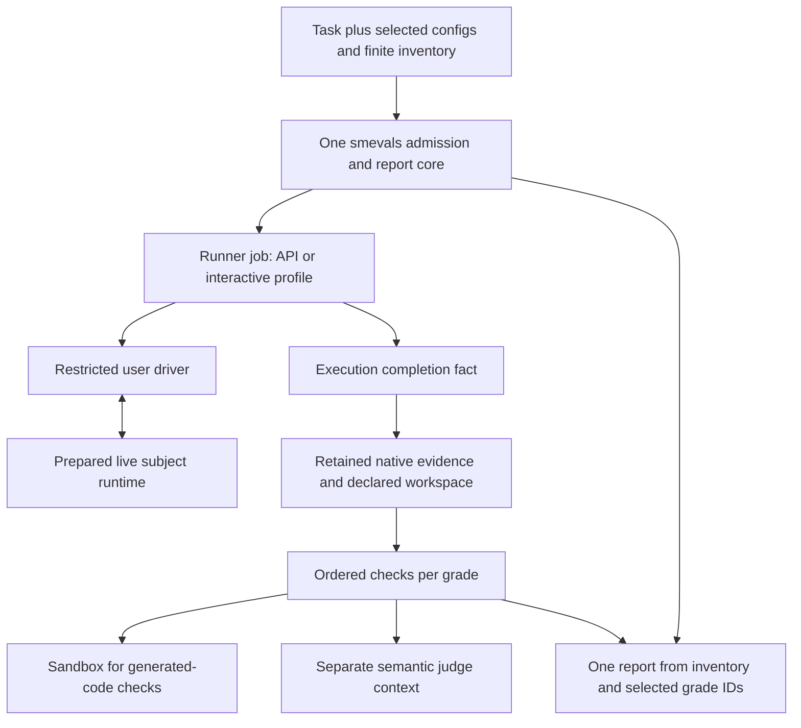

# Unified evals: staff architecture and methodology review

**Date:** 2026-09-07. **Verdict:** Keep the architecture; revise the proposed
specification before implementation. **Reviewed revision:**
`753af61124f43f0a3599c0be6f06b4843d35a80d`.

Drew asked for an independent subagent team to whiteboard the proposal,
compare it with old/current Superpowers Evals and smevals, and challenge whether
it meets the six requirements. Six reviewers covered principal architecture,
appliance/runtime engineering, performance, harness integration, evidence and
reporting, and eval methodology. They received fresh task context, read the
whole committed spec, inspected relevant source/history, then cross-examined
one another's strongest conclusions. The root reviewed their source citations,
offline receipts, and disagreements and made the recommendations below.

This is a review, not implementation approval. The reviewed spec and runtime
source were left unchanged. No live eval, provider request, remote operation,
deployment, or new credential access occurred. Three small offline probes
exercised current capture/grading code; other implementation findings are source
inspection. Earlier appliance measurements remain historical snapshot evidence.

## Decision

**We are aiming at the right product, but moving to smevals will not by itself
make the evals faster, more faithful, or easier to operate.** The new design's
value is one finite execution path, a whole-conversation worker, assessment after
interaction, and one inventory-based report. Those cuts remove real problems.
The existing smevals execution/report engine does not implement them and needs
substantial replacement. Selected Quorum, Gauntlet, CSD, and smevals code is
useful; none is a ready-made implementation of the proposed boundary.

All six seats independently returned **REVISE, sound direction**. Cross-examination
reduced the proposed mechanisms rather than accumulating them. We do not need
a general workflow engine, per-call quota controller, child-agent orchestrator,
continuous filesystem recorder, recovery writer, seals, or a second scheduler.

The most consequential omissions are:

1. The supposedly generic request is still shaped like a Superpowers scenario;
   an existing API eval and its artifact-processing grader must use the same core.
2. A completed interaction can be lost if the worker dies during capture. The
   simulated user's permitted observations and stopping policy also need a
   concrete boundary independent of grading success.
3. Final files and a timestamp-merged transcript cannot prove historical approvals,
   parent/child behavior, or reconstruct a delivered workspace for regrading.
4. Running generated tests needs a real sandbox. Finite cancellation and failed
   writes need short, explicit stop/report rules even without recovery.
5. Session slots do not bound native subagent/provider demand, and separate queues
   do not create spare provider, CPU, memory, or storage capacity.
6. Bad output that blocks a later check must stay a behavioral failure. Reports
   must show delivery/assessment yield and stable grade selections, not merely
   a success rate among surviving completed samples.
7. The first proof needs known negative cases and independent output checks.
   The selected Go fixture currently contradicts its advertised `--depth` behavior.

These are corrections to the proposed boundaries and first proof, not reasons
for another broad architecture program. My recommendation is to amend those
contracts in place, then plan the smallest shared API/interactive slice and
qualify it before porting the full suite.

## Does it meet Drew's requirements?

| Requirement | Assessment | What still has to be established |
|---|---|---|
| Natural-ish prose/YAML; author defines almost none of the exchange | Yes in shape | Shared simulated-user policy handles normal questions without a mandatory dialogue DSL; scenario-specific exact stimuli remain optional |
| Drive a real harness as an end user | Achievable, not established by the existing adapters | Prepared runtime control, native questions before turn completion, user-visible observations, correct plugin/model configuration, and honest interaction endpoints |
| Arbitrary groups of supported models/harnesses | Yes with a complete resolved configuration contract | Native child/delegation settings, explicit connection/resource units, full matrix inventory, no silent fallback or dropped cells |
| All models/harnesses supported by Superpowers | Eventual goal, not delivered by the first slice | The inspected Superpowers README has 14 installation surfaces; CLI coverage does not qualify Codex App, GUI paths, or other missing adapters |
| Standardized transcript/output report | Strong improvement, with concrete semantic corrections | Artifact reconstruction, causal/approval evidence, dependency attribution, explicit report inclusion and grade IDs, all-role cost coverage |
| High parallelism within/across harnesses | Appropriate execution shape, no new capacity proof | Actual user/subject/child/judge demand, all-worker host limits, bounded staging, responsive control, and measured completed/assessable throughput |

The first Claude/Codex slice proves neither all-harness coverage nor the general
value of Superpowers. It qualifies two configured coding systems under a defined
simulated user. A later base/head or enabled/disabled comparison can answer a
Superpowers treatment question while holding the unrelated instrument fixed.

## Comparison with the existing systems

| Area | Old/current behavior | Proposed direction and review disposition |
|---|---|---|
| Execution ownership | Direct Quorum scheduler and separate campaign controller; smevals/Studio have their own execution paths | Keep one smevals dispatcher/reader; adopted CLI/Studio paths must delegate to it |
| Parallelism | Quorum had a concurrent scheduler in June; recent campaigns demonstrated six overlapping sessions | Preserve real concurrency; a new package name or `--jobs 16` is not an improvement measurement |
| Conversation | Gauntlet receives private ACs, QA persona, evaluation reminders, and general shell tools | Separate conversation-only user behavior and a restricted prepared-session transport from grading |
| Grading | Gauntlet verdict intertwined with completion; smevals uses exit codes and required-check short circuits | Explicit execution/capture/check results; keep independent evidence and causal prerequisite failures |
| Capture | Tool-count validity, dropped parse failures, timestamp merging, cwd-based session filtering | Reuse parsers selectively; retain native per-session evidence, coverage and relevant causal relationships |
| Evidence | Useful approval receipts and manifests mixed with campaign authority and publication policy | Keep exact observations and reconstructable outputs without importing campaign objects/seals |
| Supervision | Synchronous publication/hashing can delay control; smevals concurrency waits for all generation before grading | Keep slow operations outside the supervisor and grade completed runs incrementally |
| Reporting | smevals top-up/pooling, grade overwrite, and Studio busiest-config selection | Finite selected inventory; explicit grade selections; one common report projection |
| Credentials | Useful harness delivery, but model/route/auth/capacity coupled; ambient defaults survive in some paths | Reuse auth sources and delivery; separate configuration and qualified capacity; isolate writable state |
| Failure handling | Valuable exact identity/death checks coexist with large journal/sealing machinery | Keep finite ownership, cancellation and visible unknown/error states; discard resume and compatibility machinery |

Primary source anchors include [the existing scheduler](../../src/scheduler/index.ts),
[campaign publication](../../src/campaign/attempt-publish.ts),
[capture](../../src/capture/index.ts), and
[the current composer](../../src/composer.ts). The individual seat reports below
contain exact line citations into pinned smevals, Gauntlet, and CSD checkouts.

### The uncomfortable historical comparison

The [August 17 panel](2026-08-17-platform-direction-panel.md) already diagnosed
review accretion, bespoke campaign ceremony, and building before proving the
small execution path. It examined smevals main at the **same `0c28dc6` revision**
and recommended emulating its concepts rather than adopting its engine. The
[next review](2026-08-17-platform-spec-adversarial-review.md) added sixteen
convergent amendments; its recorded estimate grew from 4–6 to 5–7 weeks.
Those are historical judgments and estimates, not a measured implementation cost.

The old objection to the engine remains valid. Our changed recommendation is
justified by the current scope: one product, no Quorum compatibility, no recovery
or sealing requirement, and API plus live-harness evaluation through common
contracts. **Consolidating in smevals is a product/repository decision, not a
claim that its unchanged engine is sufficient or integration will be cheap.**

The lesson for this review is to preserve useful properties with the smallest
mechanisms, then prove a real slice. Another long green review cycle would not
substitute for installed harness and evidence proof. The
[September 4 validation record](2026-09-04-core-comparison-validation.md)
already distinguished thousands of passing portable tests from unperformed
installed Linux, live comparison, and timed usability checks.

## Required corrections, with smallest resolutions

### 1. Make the common executable contract genuinely common

The spec promises first-class API evals but defines targets using harness,
Superpowers, permission, and user fields. Existing smevals also evaluates
arbitrary nested task/config inputs and performs artifact transforms. Without
one complete API example, an implementation can satisfy the three coding
scenarios while leaving ordinary smevals on its old executor.

Use one envelope carrying identity, complete task/config payload, executable
identity, paths, limits, connections, and runtime/resource requirements.
Interactive fields belong to the interactive profile. User/judge model-client
configs can share connection/model primitives without pretending to be coding
harness targets. Define one runner/driver selection rule; do not leave conflicting
precedence between task and config files.

For grading, use **ordered checks within a grade**, dependencies only on earlier
check IDs, declared named outputs, and at most one active check per grade.
Independent later checks still run after a failure. Different grades progress
through the common core concurrently. Consumers receive validated outputs from
the same grade invocation. This preserves smevals' SVG extraction → validation
→ rendering → judging use case without a general DAG engine or shared mutable
filesystem conventions.

A fake API Runner and the existing transform chain, using a fake judge, can
prove this shared path without provider calls. No historical CLI/result
compatibility bridge is required.

### 2. Define the interaction boundary, not an authored exchange

Gauntlet's current TUI adapter starts a host shell and ignores its target in
`start`; its shared tools expose host shell operations. CSD's turn-waiting
interface can miss a native question that pauses inside a turn. Neither is a
drop-in host-driver → subject-container transport.

The required behavior is small: control only the prepared runtime; deliver
user messages and native answers; observe actual waiting/turn/exit states;
never send the next message into a fallback shell after subject exit. Exact
adapter event types belong in the first Claude/Codex implementation, not a new
universal protocol specification.

Separate **driver-visible observations** from **complete grading evidence**.
The simulated user sees messages, dialogs, public activity and legitimately
presented files. Full native reasoning and child-private work may be retained
for grading without being fed to the user model. Restrict tools in code; a
prompt saying “do not repair files” is insufficient when general shell access
is available. Freeze the user policy/prompt and tool surface. Violating a
mandatory user policy is an instrument problem, not a subject failure;
ordinary subject-induced variation remains valid.

Separate the scenario's observation endpoint from the runtime watchdog.
The purpose-discovery scenario's 25-minute observation horizon is explicitly
a completed experiment to grade. A hard watchdog interrupt before an intended
endpoint remains incomplete. State clock origins; an interaction horizon should
start at the first accepted task input, not during image/setup work.

Persist a **small trusted completion fact before capture**. A review delivered
at 24:59 must not become an unfinished subject run because export stalls at
25:00. The core can read that fact after the worker exits; later capture or
grading failure does not erase completed interaction. Keep the proposed slot
reservation through bounded capture. No early-release handshake is necessary.

### 3. Retain the evidence the criteria actually require

Two tiny probes of current `captureToolCalls` reproduced concrete hazards:

| Synthetic source | Observed current result |
|---|---|
| A valid final refusal with zero tools | One source found; zero tool rows; `trajectory.json` absent |
| A parent tool event plus malformed child log | Two sources found; one retained step; trajectory present; no per-source failure diagnostic |

These probes establish current offline behavior, not a live harness failure rate.
They show why reusing the capture orchestrator unchanged would break the new
completed-bad-outcome contract.

Retain per-session native sources with stable actor/parent/source references
and explicit parse/coverage diagnostics. Timestamp order can render a transcript;
it cannot prove that a reviewer returned before the parent proceeded. A child's
`user` message may be the parent's delegation instruction, not Drew's approval.
A dispatch acknowledgment is not review completion. Unknown/missing evidence
cannot prove a negative or ordering claim. Keep a merged view as a convenience,
not the authoritative source.

When the driver reads a presented artifact, retain the exact bytes it saw and
the corresponding interaction event. Final version B plus “approved” cannot
prove approval of earlier version A. This is needed by the purpose scenario;
it does not require continuous workspace recording or whole-tree scans per turn.
The scenario must also state whether cosmetic approval-status edits invalidate
approval, rather than inheriting that controversial policy accidentally.

For output regrading, retain a self-contained final tree or an observed setup
baseline plus complete final delta, with named launch/delivery roots, included
untracked files, deletions, modes, links and omissions. Git/worktree facts and
objects are required only for criteria that use them. An empty `git diff HEAD`
does not mean no work was delivered; a copied linked-worktree `.git` file may
point to a deleted runtime. Prove reconstruction by deleting the original
runtime and relocating only retained evidence before rerunning the checkers.

Native profiles and reconstruction details can remain specific to the first
scenarios. A universal ATIF ontology or archival system is unnecessary.

### 4. Keep finite runtime ownership and real checker isolation

A separate grade directory does not isolate generated code. Current smevals
executes checkers directly with inherited host environment. A generated build
hook or test can read other runs or write outside that directory even without
malicious intent.

Execute generated output in a disposable sandbox using the same host primitive
as the subject runtime, with selected read-only evidence, private scratch, no
sibling mounts/host Docker socket, and no user/judge credentials. Trusted semantic
judging has its own selected auth; generated test children must not inherit it.
Bound trusted Runner/capture/publication processes as well as subject containers.

For ownership, one named appliance service, durable active-batch claim, cancel
marker, exact runtime IDs, and inventory-based status are sufficient. Normative
properties: cancel prevents future starts; a dead owner cannot resume; successful
cleanup means neither an owned runtime nor a pending old start can execute;
required identity/state-write failure stops admission; termination does not
depend on another successful write. Missing records remain visible unknowns or
errors derived from the accepted inventory. Cached status cannot override them.

The exact service, atomic-write, and container-removal ordering belongs in the
plan and fault tests. The runtime reviewer withdrew the initial proposal for
a separate takeover writer/launch-settlement subsystem. No storage ballast,
replay engine, recovery controller, or seal is justified by these requirements.

### 5. Specify capacity honestly across all actors and phases

A target can be a native mixed-model team. Current Superpowers explicitly
selects child models and reasoning effort; the parent label does not identify
all SDD work. Preserve native delegation, freeze relevant installed defaults
and allowed routes, record observed child model/effort where available, and
name unknowns. Do not force all children onto the parent model merely to make
the accounting easier.

Define pool units as qualified **session/profile reservations**, not guaranteed
API request or TPM caps. Include declared child fanout/demand and all relevant
model/account groups. Reject impossible demand vectors before launch. Shared
auth does not create or define quota. Profiles without established demand
remain unqualified; this does not require a child controller or per-call proxy.

The proposed user Sonnet route currently has a configured six-seat cap. With
one user seat per live interaction, it admits at most six such interactions;
if two judges share that pool, at most four live interactions fit. Configured
jobs 8 or 16 does not alter this arithmetic. These are policy limits in the
inspected snapshot, not independently queried provider ceilings. Qualify a
feasible route/profile before claiming eight or sixteen live sessions.

Make the heavy host allowance cover build/browser Checker work as well as live
subjects. Two heavy subjects plus two heavy checkers is four heavy jobs unless
all draw from the same host group. Bound outstanding evidence and aggregate
CPU/memory/PID/storage use. Separate queues protect the control loop's structure,
but do not prevent host OOM or disk exhaustion. Exact numbers/watermarks belong
in implementation and qualification.

Keep deterministic feasible admission across targets/repetitions/roles. Do not
restore the old first-429 latch that silently drops queued rows. Version one
can use fixed reservations/spacing, native client retry behavior, and completed-run
throttle diagnostics for subsequent finite delays. Explicitly defer immediate
in-flight group backoff; no live feedback protocol is necessary now.

Keep slots through capture until measurements justify an optimization. Correct
the proof wording: slow capture must not block control or unrelated eligible
work **when capacity exists**. If every reserved slot is capturing, withholding
new work is the deliberate policy, not a scheduler defect.

### 6. Make grading and reports preserve the cause of failure

The spec currently says any required dependency skip makes the grade an error.
That regresses a useful existing behavior: current smevals grades malformed
SVG as **fail**, with downstream rendering skipped. The third offline probe
confirmed this. The new spec would reclassify the bad output as an instrument
problem; no implementation of the proposed rule was run.

Use causal blocking: a prerequisite behavioral failure blocks downstream checks
without converting the overall failure to error; a missing renderer or failed
instrument blocks them with an error. Successful transforms missing their
declared artifacts are instrument errors. Independent checks continue. A
conclusively failed prerequisite can establish a determinate overall fail even
when dependent quality criteria were not assessed. Report their assessment
counts separately; do not exclude that failure again under “fully assessable.”

Make report inclusion a single pure projection. Display selected/eligible,
started, completed, determinate pass/fail, instrument/incomplete counts, and
per-criterion assessment coverage. For example, A with 1 pass/9 timeouts has
100% pass among its completed runs but only 1/10 confirmed passes; B with
9 pass/1 fail has 90% conditional pass and 9/10 confirmed passes. Do not rank A as
better from the first percentage. Unsupported cells are coverage gaps, not
behavioral failures. Optional capture problems remain visible but need not
erase conclusions supported by valid required evidence.

Exploratory views may choose the latest terminal grading invocation, including
an error. Saved comparisons select one grader revision per scenario and pin
the exact grade IDs and invocation-selection rule. Regrading must not silently
change an earlier readout or improve an arm by repeatedly judging only its
failures. No seal or statistical platform is required; ordinary saved report
metadata suffices.

Keep all invocation costs, including failed/obsolete grading, separate from the
selected grade's cost. Distinguish not-used/not-started roles, unknown usage,
observed zero, and known partial subtotal. Subject cost includes attributable
native children. Reuse useful obol pricing provenance; no new cost controller.

### 7. Make the first proof discriminate good measurement from green JSON

The selected Go design promises working `--depth`, but its supplied implementation
validates then ignores it ([design](../../scenarios/sdd-go-fractals-opus48/fixtures/design.md),
[plan](../../scenarios/sdd-go-fractals-opus48/fixtures/plan.md)). Existing checks
mostly run the subject's supplied tests and inspect files/commits. They can pass
faithful execution of the defective plan. Its old stopping rule also waits for
actual delivery to main, which can coach away a bad delivery claim.

For the first proof, use a separately versioned, coherent Go fixture with
independent CLI/output assertions. Preserve the historical fixture as historical
or as an explicitly flawed-plan scenario; do not silently change it and treat
its old results as comparable. Stop on a genuine final delivery claim even when
work is stranded; checking decides whether delivery actually happened. Drop the
incidental four-commit proxy unless commit history is itself the intended test.

Keep the three scenario categories, and add one small **API/transform example**
through the same engine. Before broad live qualification, use a compact reviewed
evidence pack containing compliant, known failing, and unassessable cases:
wrong review; correct output with wrong workflow; refusal without tools; missing
child; approval A followed by edit B; malformed output versus broken checker.
This validates criterion meanings as well as protocol parsing.

Frozen user policy and judge prompts should keep evidence as quoted task data;
remove unnecessary target labels from judge inputs when practical. Full blinding
may be impossible; don't claim it. Known input/fixture labels can be reviewed
offline. Calling a semantic judge on retained evidence still spends provider
tokens and belongs in the later authorized calibration/run plan. Spot-check the
first real interaction/evidence bundle for each harness before calling it qualified.

Also verify effective setup: the intended plugin/version was exposed through the
harness's supported mechanism, settings survived polluted host defaults, and
observed model mismatches are surfaced. A source SHA alone is not proof of loaded
behavior. Do not force a skill invocation into the measured scenario just to
prove exposure, or demand impossible provider attestation when served identity
is genuinely unavailable.

## The resulting small architecture

The API Runner bypasses the user/harness branch. The core schedules complete
jobs, not conversation turns. The host adapter owns bounded runtimes. The
worker/driver owns interaction. Evidence profiles describe what can be proven.
Checks own assessment. All readers consume the same records. These are ordinary
modules/processes in one product, not a set of new services.

## Disagreements resolved and alternatives retained

| Question | Initial pressure | Final recommendation after cross-examination |
|---|---|---|
| Release seats before capture? | More concurrency versus another state transition | Hold seats in v1; persist completion separately for truthful attribution; measure before optimizing |
| Checker dependencies? | Per-check parallel DAG versus a shared serial grade directory | Ordered checks, prior-ID dependencies, explicit artifacts, independent outcomes; concurrent grades through the same core |
| Crash/storage ownership? | Separate takeover writer and launch-settlement machinery | Small stop/report invariants implemented with one service/claim/marker and exact runtime cleanup |
| Native child demand? | Dynamic child/request scheduling | Preserve native delegation; declared profile demand, observed child identity, honest qualification |
| Evidence history? | General temporal recorder | Record exact allowed artifact reads and final declared workspace; native source/causal evidence only as criteria require |
| In-flight 429s? | New operational event channel | Fixed reservations plus after-run diagnostics in v1; reactive immediate feedback explicitly deferred |
| Python versus Bun core? | Python treated as the natural cheaper choice | Python is a provisional product/packaging convention, not a proven cost or performance win; keep one core whichever implementation wins |
| Gauntlet versus a smaller driver? | Preserve existing driver versus native-session-first user loop | Try the conversation-only seam against actual question/negative-case behavior; switch if extraction retains broad QA shell/prompt machinery |

The strongest alternative is a small native-session conversation loop using
selected Gauntlet/CSD pieces rather than adapting Gauntlet wholesale. Native
protocols still must demonstrate the same user-visible harness behavior; an
app-server mode that changes tools/questions is not automatically equivalent.
Keep the driver replaceable and decide from the concrete seam, not brand loyalty.

A small Bun supervisor inside smevals is also credible if it materially reduces
new code without retaining a parallel Python executor. No evidence establishes
Python-versus-Bun as the performance lever. Wrapping the existing Quorum campaign
controller beneath smevals would retain the principal complexity we intend to
remove and is not the recommended alternative.

## Decisive proof and limits of the capacity evidence

The historical September 4 cohort had 150 verdict intervals over about 121
minutes with peak overlap six and mean 5.42. The source/data review confirms
this arithmetic; it measures whole-run occupancy, not simultaneous provider
requests or CPU utilization. Go fractals was about 4.3% of 743 retained rows
and 23.2% of run-hours. That establishes long occupancy, not that every Go run
is CPU-heavy. Different old cohorts do not establish a causal before/after
refactor speedup or slowdown.

The first proof should establish, in order:

1. **Common engine semantics offline:** API and interactive payloads survive
   resolution; finite matrix rows all remain; malformed results, invalid output,
   broken checker, and dependent skips have the right outcomes.
2. **Real runtime mechanics without models:** disconnect/reconnect, duplicate
   submission, cancel during launch/capture/checking, supervisor death, failed
   writes, slow preparation/publication, generated-code sandbox confinement,
   finite cleanup, and resource counters. Use actual processes and owned
   runtimes where needed, not tests of rendered command strings.
3. **Evidence validity:** relocate retained artifacts after deleting the original
   runtime; preserve refusal, child identity, output delivery, approval versions,
   and grading invocation selection. Known-good/known-bad evidence must produce
   the intended deterministic and later authorized semantic judgments.
4. **Small real harness slice:** the three coherent scenarios on Claude/Codex,
   with manual inspection of the first actual user interaction/evidence/grades.
   This is authorized separately from this review.
5. **Capacity qualification:** fresh equivalent workload at a feasible low-load
   reference, then 8 and 16 only when role-resource policy permits actual load.
   Use enough repetitions to sustain the wave; six cells cannot prove sixteen
   concurrent interactions. Count setup, capture, grading and final drain in
   useful completed/assessable throughput. Report failures, 429s and usage gaps;
   do not replace samples or change the user model mid-comparison.

Select paid sample counts, ceilings, and acceptable live slowdown/error thresholds
in the run plan, not by inference from unrelated old campaigns. A fake scheduler
can qualify mechanics at sixteen while the live user route remains qualified at
six. Those are different outcomes and the higher live requirement remains open.

A scheduler-only comparison can reuse identical fake service demands. A full
old/new product comparison changes the user/grader instrument and must say so.
The practical target is more trustworthy completed reports per unit time and
less operator work, not merely faster submission or more containers.

## Review artifacts and receipts

The detailed reports preserve source citations, alternatives, counterexamples,
qualification unknowns, and cross-examination amendments. Their closing
cross-examination sections supersede more prescriptive initial recommendations.

- [Architecture](/Users/drewritter/.codex/visualizations/2026/09/07/01a07cbc-47f5-70d0-803e-acdaff77da82/unified-evals-review/architecture.md)
- [Appliance/runtime](/Users/drewritter/.codex/visualizations/2026/09/07/01a07cbc-47f5-70d0-803e-acdaff77da82/unified-evals-review/runtime.md)
- [Performance and capacity](/Users/drewritter/.codex/visualizations/2026/09/07/01a07cbc-47f5-70d0-803e-acdaff77da82/unified-evals-review/performance.md)
- [Harnesses, user fidelity, and credentials](/Users/drewritter/.codex/visualizations/2026/09/07/01a07cbc-47f5-70d0-803e-acdaff77da82/unified-evals-review/harnesses.md)
- [Evidence, Checker contracts, and reports](/Users/drewritter/.codex/visualizations/2026/09/07/01a07cbc-47f5-70d0-803e-acdaff77da82/unified-evals-review/evidence.md)
- [Eval methodology](/Users/drewritter/.codex/visualizations/2026/09/07/01a07cbc-47f5-70d0-803e-acdaff77da82/unified-evals-review/evals.md)
- [Root history investigation](/Users/drewritter/.codex/visualizations/2026/09/07/01a07cbc-47f5-70d0-803e-acdaff77da82/unified-evals-review/history.md)
- [Probe scripts and receipts](/Users/drewritter/.codex/visualizations/2026/09/07/01a07cbc-47f5-70d0-803e-acdaff77da82/unified-evals-review/evidence-probes/)
- [Earlier sanitized capacity readout](/Users/drewritter/.codex/visualizations/2026/09/07/01a07cbc-47f5-70d0-803e-acdaff77da82/evals-capacity/READOUT.md)

Those absolute paths are supporting evidence on Drew's machine, not portable
runtime dependencies. The current review reads sources at Superpowers Evals
`753af611` (runtime unchanged from `32b403be`), smevals main `0c28dc6`,
reusable-runners `45676af`, concurrency `a20b677`, Studio `94a8c209`, Gauntlet
`588a81e8`, CSD `e608d693`, and Superpowers `b36e0829`. Source locations and full
revisions are recorded in the seat reports.

The saved probe scripts reproduce the actual APIs' behavior on temporary
synthetic fixtures. Their stdout/stderr were copied from observed tool results;
the initial Python import failed for missing `click`, then succeeded in an
already existing environment. Nothing was installed. The root inspected the
scripts/results and primary source without repeating the probes. Neither these
checks nor the panel's agreement qualifies a deployed engine or a live model.
