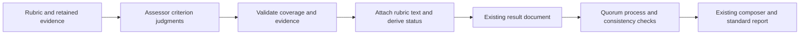

# Conversation grading increment: staff review

Date: 2026-09-08 Pacific
Status: review complete; Drew subsequently requested the implementation plan
for the recommended revision.
No implementation, tests, provider calls or appliance operations were performed.

## Recommendation

Proceed with the small assessment-contract fix. Revise the retained experiment
before execution: five distinct cases once each, explicit diagnostic completion,
and an honest plan for operating the existing assessment child. Keep the
mechanical fix independently shippable.

This reviews [the proposed spec](../superpowers/specs/2026-09-08-conversation-grading-contract-design.md)
at `0c712473`, Quorum `6dc62849`, and Gauntlet `f5d66447`. The recommendations
below have since been incorporated into the spec for implementation planning.
They have not been executed.

Four independent read-only reviewers covered the contract, grading methodology,
operations, and product direction. Contract and direction reviewers returned
GO. Methodology and operations reviewers requested specific revisions. A short
cross-review supported the five-case revision and fixed diagnostic completion;
there was no recommendation to replace the engine or add grading infrastructure.

## Why grading is the right next step

The historical [matched pricing cohorts](2026-09-07-conversation-broad-signal.md)
already recorded four simultaneous Claude/Codex conversations and campaign
elapsed times of 1062.797 seconds at cap one versus 331.414 seconds at cap four.
The observed throughput ratio was 3.206856. This small, ordered experiment
demonstrates useful concurrency in those cells; it does not establish sustained
capacity, every harness, or improvement over the old engine. The more recent
[three engine gates](2026-09-08-conversation-startup-evidence/live-results.md)
add qualified startup and Pi evidence paths. These are retained receipts, not
live checks rerun for this review.

Meanwhile, [completed bad designs still received passes](2026-09-08-conversation-reliability/results.md).
The Codex assessor had read the decisive final proposal before substituting
generic completion notices for the required watched-task relationship. Its
published transcript coverage was independently checked. More capture or
scheduling machinery would not address that demonstrated semantic mistake.

## Mechanical contract: retain the proposed shape

Gauntlet's assessment currently imports the generic QA tool and its deliberately
permissive overall-status policy (`gauntlet/src/assessment/assess.ts:169` and
`gauntlet/src/agent/validators.ts:288` at the reviewed head). Generic QA may
identify failures outside its listed criteria; conversation assessment grades
the supplied rubric. A local assessment tool/parser and pure reducer give that
distinction a small, concrete implementation boundary.

Keep fail-over-unclear-over-pass reduction, canonical rubric text, complete
criterion coverage, the existing result shape, and Quorum's exact status
consistency guard. Keep the current composer precedence and generic QA behavior.
The [standard Quorum renderer](../../src/cli/render.ts) already shows criteria and
evidence; changing generic Gauntlet Markdown is unnecessary.

Two limits must remain explicit:

- Positional rows cannot detect a model silently grading the wrong criterion in
  a row. An explicit run-local index could catch identified reordering or
  duplication, but cannot solve semantic misassignment. No observed ordering
  failure justifies a new identity scheme in this increment.
- Quorum's [existing guard](../../src/runner/conversation.ts) checks nonempty rows
  and consistency, not completeness against the rubric. Gauntlet owns exact
  coverage. Do not describe the Quorum guard as independently validating the
  entire rubric contract.

## Semantic experiment: five contrasting cases, once each

The four-by-two proposal spends duplicate calls before reaching all distinct
questions and has no passing review. Its general grounding instructions could
become excessively strict about conditional security risks and still pass the
negative review. The already-settled positive Codex review covers that risk.

Recommended fixed order:

| Order | Retained case | Expected criteria | Purpose |
| --- | --- | --- | --- |
| 1 | Claude design `20260908T195051Z-874b` | fail/fail/pass | Detect the demonstrated missing watch choice |
| 2 | `known-claude-design` | pass/pass/pass | Preserve a sound proposal with permitted assumptions |
| 3 | `known-codex-review` | pass/pass/pass/pass | Accept grounded conditional risks and scoped verification |
| 4 | Codex design `20260908T195053Z-0d17` | fail/fail/pass | Detect the same obligation missed in different evidence |
| 5 | `known-claude-review` | pass/pass/pass/fail | Retain whole-review grounding and correct derived status |

The known case identities and expectations are already recorded in
[cases.json](2026-09-08-conversation-release/cases.json) and
[expected.json](2026-09-08-conversation-release/expected.json). Both known reviews
use the settled [clarified review rubric](2026-09-08-conversation-release/controls/rubrics/code-review-revised.md).
The two later designs keep their exact retained rubrics and independent
adjudications. The positive review's conditional risks do not need to become
proven exploits to satisfy that rubric. The positive design's explicitly
unresolved assumptions remain permissible. No gold judgment changes.

Use one frozen general instruction treatment, unchanged model/pricing, full
authenticated evidence, and fresh assessor history without old grades or gold.
Make **five assessments maximum**, with the proposed **$4 observed stopping
threshold**, **45-minute total window**, serial execution, and existing
**120-second outer child bound**. These are assessment invocations, each of
which may contain multiple provider requests and tool-repair turns.

The diagnostic completion rule is a proposed change requiring approval before
execution:

- A valid semantic mismatch permanently fails this candidate's promotion gate.
  Continue only the remaining predeclared cases to learn whether it misses
  requirements, invents requirements, or does both.
- Stop immediately on execution/accounting/input/ownership failure, budget or
  time exhaustion, cancellation, or a newly substantiated independent gold
  disagreement. Candidate disagreement alone does not reopen settled gold.
- Never change the candidate, rubric, order, allocation or evidence mid-run.
  No replacement calls, second candidate, or attempt to vote a failure away.

All five criterion vectors and materially decisive rationales must be supported
for prompt promotion. Alternative valid explanations remain acceptable.
One pass per case is weak evidence about variability; two repetitions per case
would also be insufficient for a reliability claim. Report only the observed
known-case outcome, not causal improvement or population accuracy. The existing
debugging/test-history false pass remains outside this qualification.

## Operational correction: reuse the child, not the closed stage

The [old retained operator](2026-09-08-conversation-reliability/run.ts) is 942
lines and fixes a candidate path, a $8 allocation, a 90-minute window, and
twelve rows per stage. Its execution loop advances after process/accounting
validation; case declarations alone cannot provide the proposed behavior.

The smallest credible plan is a short dated entrypoint for one declared
`gauntlet assess` invocation, reusing the existing child, lease, scoped
credentials, source verification, timeout/cleanup and pricing behavior. Keep
one frozen five-row allocation record and cutoff. The appliance owns each
bounded child; the coordinator polls its receipt and reviews result/accounting
before requesting the next row within the approved fixed plan. This does not
require another permission from Drew between rows. Do not clone the stage
operator, add a waiting service, or build a production replay command.

Authenticate old known packages against their release corpus records and later
designs against their campaign report and retained artifact inventory. The old
corpus verifier does not automatically cover those newer evidence packages.

There is also a concrete accounting guard to include: repriceable sidecar rows
do not establish that every returned provider turn has usage. Gauntlet logs a
sidecar row only when `rawUsage` exists, while counting all returned turns
(`gauntlet/src/assessment/assess.ts:77-92,212-220`). The old operator only checks
whether the sidecar reprices. Require returned-turn usage coverage before
calling accounting complete; preserve interrupted or uncovered usage as unknown.
Exercise that narrow check behaviorally without redesigning accounting.

## Verification and delivery

Explicitly run the existing [paired CLI suite](../../test/runner-conversation-gauntlet-integration.test.ts)
with `GAUNTLET_ROOT` pointing at the assembled candidate. Otherwise it skips;
ordinary conversation tests use a fake Gauntlet executable. Cover the new tool
submissions, writer/exit/consumer behavior, and outer child interruption as well
as completed uncertainty. Gauntlet's inner deadline does not by itself interrupt
an awaited provider request.

Ship the mechanical fix after offline checks and source review, independently
of semantic results. Promote the prompt only if all five retained cases pass
the proposed acceptance condition. Verify the actual canonical campaign source
installation separately; the latest deployment intentionally did not refresh
image-baked legacy Gauntlet.

Then return to a user-visible product milestone: author one useful non-pricing
scenario through the ordinary workflow, run a small mixed-harness matrix at the
existing concurrency, and inspect one standard report for completion, output,
grades and cost. Its value is useful new scenario signal without bespoke engine
work. Another generic pricing speed demonstration or open-ended calibration
program is not the next milestone.
