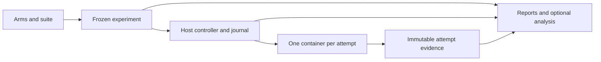

# Campaign consolidation: one execution model, useful comparisons

**Date:** 2026-09-04
**Status:** Local implementation and final staff review complete; all findings
corrected and re-reviewed. The full portable gate passed at `560ebeb1`.
Separate Linux, installed-appliance and usability qualification remain pending.
Resume/restart and coordinated subject lifecycle/error reporting are deferred.
**Scope:** consolidation of the campaign kernel and appliance V2 roadmap.
**Source baseline:** main `f8e1889c`; appliance work `65c28448` on
`drew/child1-tasks-15-17-recut`. Recorded tests and live runs are evidence
from those sources, not verification repeated by this design exercise.

## Decision and precedence

Keep the arm, suite, sample, attempt, and immutable-evidence model. Use one
host campaign controller and one container per attempt. Simplify the
controller's persistence and ownership boundaries before adding features.
The deliverable is a comparison an operator can configure, run, inspect,
and understand without a custom driver or result extractor.

The current increment delivers that comparison within one controller session.
If the controller is lost, preserve the evidence and terminate remaining work;
the campaign cannot resume or restart. Continuing interrupted campaigns belongs
to the next increment. This overrides the earlier V2 availability requirements.

This is the accepted forward direction for the remaining campaign work:

| Earlier direction | Disposition |
|---|---|
| Platform revision 3: comparative questions as configuration; human release judgment | Retain. |
| D1-D4a implementations and their historical artifact contracts | Preserve as the explanation of V1 behavior and evidence. |
| V1-specific D4b gating seal, adjudication, and operator integration | Pause. Do not build a second supported campaign lifecycle on the format V2 retires. |
| Appliance V2: host controller, isolated attempts, measurement-only cost | Retain, subject to the consolidation decisions below. |
| V2's four-child sequence and its durable-contract details | Replace where they require duplicate authority or independently committed fragments of one internal transition. The delivery sequence below governs consolidation planning. |
| V2 resume/restart, worker adoption, and recovery admission | Defer to the next increment. Retain only the ownership information and cancellation path needed to terminate interrupted work. |
| Separate formal qualification campaign and automatic release authority | Remain retired. Required executor verification still applies. |

The detailed contract requires written review before implementation planning.
This document authorizes no deployment, artifact migration, deletion, or paid
run. Existing V1 behavior does not change merely because its roadmap changes.

Three approaches were considered. Continuing the current additive roadmap
preserves two incompatible destination products. A wholesale rewrite repays
working provisioning, capture, eligibility, and evidence contracts. The chosen
approach reuses those components and changes the boundaries that currently
manufacture recovery work or duplicate decisions.

## Product boundary and ownership

The supported campaign product runs on one Linux appliance for trusted
maintainers, with one live campaign per appliance and parallel attempts inside
it. It supports the existing model/credential, agent, scenario, and
superpowers-ref-or-none comparison axes where adapters declare support.
Adding per-arm grader treatments or selectable harness executable versions is
outside this consolidation. Record observed versions without inventing new
treatment dimensions.

| Responsibility | Owner and boundary |
|---|---|
| Experiment intent | Frozen registration: expanded sample/block inventory, input identities, execution limits, and measurement policy. |
| Admission and replacement selection | One controller session; durable decisions in one SQLite journal. Dispatch, status, and reports derive from the same event semantics. |
| Cancellation after interruption | A fenced cancellation handler reads ownership, stops workers, and records termination. It has no admission or sample-replacement authority. |
| Process existence | Container runtime, checked against journaled identities. A dead controller does not establish dead attempts. |
| Credentials | Host projector stages exactly the subject and grader credentials for an attempt. Workers cannot read the host bundle or sibling attempts. |
| Observations | Immutable attempt artifacts with identities, manifests, and explicit missingness. |
| Campaign status | Read-only projection of registration, journal, and observed workers; no second lifecycle in appliance job records. |
| Command invocation | Appliance job receipt: command, controller identity, timestamps, and command result. |
| Interpretation | Deterministic reports over evidence; an optional later decision function has no execution authority. |

Preserve the existing quorum -> Gauntlet -> private tmux -> Coding-Agent
chain inside each container. Subject and grader remain cooperating components
within an attempt; separate credential files do not create a security boundary
between them. Retain host-only Docker access, private attempt mounts, exact
credential projection, and the existing worker hardening requirements.

Direct `quorum run` and `run-all` remain development workflows. Campaign
dispatch does not invoke the run-all scheduler. Workstation development must
use real platform-appropriate preflight and retain host exclusion, credential
scoping, and honest provenance; it must not require Linux test fixtures or a
forged covered-child marker. Campaign evidence still comes through the
appliance path. There is no campaign-on-macOS implementation in this scope.

## Execution and persistence

**Compile resource policy once.** Resolve credential aliases through the
existing pool identity and freeze one capacity/spacing map at registration.
Declarations in the frozen registry sharing an active pool contribute their
explicit limits: minimum concurrency, maximum launch spacing. An active pool
with an unspecified concurrency limit is a registration error. Feasibility
and dispatch consume the same map and the same complete demand vector,
including both subject and grader use when they share a pool. Per-key limits
remain subordinate constraints. No phase chooses the first matching arm or
invents a different default.

Current and prospective key grants share the resource identity `(logical pool,
public key env name)`, independently of role credential projection. Reordered or
overlapping alias inventories are valid when their derived per-key limits agree;
registration rejects contradictory limits for the same shared key. This includes
singleton API-key and bearer-key inventories. Secret values do not define pool
identity.

Retain the live resource floors and registered-versus-live CPU/memory fingerprint
comparison under the current ownership fence before admission. Telemetry older
than two sampler cadences refuses new work, including after slow preparation and
at create/start boundaries. Loss of admission freshness does not revoke the
authority needed to stop already owned work.

**Bound work directly.** Freeze finite planned samples, replacement/reserve
allowances, attempt-count limits, and per-attempt execution limits. A new
attempt always consumes a new attempt number and the applicable allowance;
behavioral failure does not purchase a replacement. Retain existing bounded
retries and whole-block replacements only within the uninterrupted controller
session and its frozen failure policy. There are no cross-session retries.
An enforced whole-attempt deadline covers setup, drive, and capture, survives
controller death, and terminates the complete worker namespace after bounded
graceful shutdown. Automatic container restart is disabled.

**Qualify failure causes at their producer.** Drew selected conservative
outcomes for subject spawn/crash/rate-limit cases whose actor evidence is
unavailable. They remain indeterminate; those signals alone authorize no
automatic retry or pool latch. Coordinated Coding-Agent lifecycle and provider
error reporting belongs to a later increment. Quorum's aggregate stderr and
exit status describe a process that also hosts runner and grader failures;
they cannot establish a subject failure. Gauntlet's intentional subject
teardown also prevents treating every subject signal as an unexpected crash.

The core retains authenticated grader rate/billing evidence and typed
setup/capture/check/misconfiguration failures. Check-manifest mismatches already
carry the composer's checks stage. A grader crash additionally requires frozen
runner-observed Gauntlet process facts: an indeterminate invocation without a
parseable result and an intrinsic fatal signal (`SIGABRT`, `SIGSEGV`, `SIGBUS`,
`SIGILL`, `SIGFPE`, `SIGTRAP`, or `SIGSYS`). Preserve stopped and permanent
misconfiguration precedence. A valid result, arbitrary nonzero exit code,
timeout-shaped code, or HUP/INT/TERM/KILL does not establish this cause.
Independently established validity failures retain their own bounded policy;
missing actor evidence never substitutes for such a finding. All attempts
remain available for accounting.

**Consume one run authorization.** Under shared exclusion, atomically record
that the campaign has started before launching its controller. Only a
never-started registration may launch a controller. Repeating `run` returns
active status or refuses a launch for interrupted or terminal work. An invocation lost
after consuming this authorization cannot retry it, even if no worker started.
A deliberate new run requires a new campaign identity and verified termination
of the old work. Status remains read-only.

The campaign identity names one invocation independently of the frozen input
digest. Registering the same inputs again produces a fresh identity with the
same input digest. Commit the sole start authorization under shared exclusion,
then publish the durable host claim before any child can launch. A crash before
claim publication consumes that start but cannot have created a worker.

Establish stable campaign/input/output roots and the minimum attempt ownership
record in this increment's format before exercising the container boundary.
Pin the public credential authority and exact projection policy for the session;
supported credential replacement paths must refuse changes while referenced
workers or a controller remain active or unresolved. Revocation prevents new
starts. Credential rotation for dormant resumable campaigns is deferred.

**Commit internal transitions atomically.** Ordered event rows remain the
audit record, but one SQLite transaction commits one indivisible transition:

- block admission and all of its attempt intents;
- replacement identity, reserve activation, and predecessor dispositions;
- acceptance of a terminal observation and its dependent evidence references.

Validate the entire group before committing; update the in-memory projection
only after commit. On failure, roll back the group. Keep standalone observations
as separate transactions where they do not depend on an accompanying record.
Retain writer exclusion and fencing. No database transaction spans a provider
call, container operation, or filesystem publication.

**Keep the real external-effect boundaries.** The following order is required:

1. Allocate attempt, output, and deterministic container identities;
   durably record execution intent before `docker create`. The runner retains
   run-ID allocation; bind that ID after verifying its publication manifest
   and attempt identity.
2. Create and inspect the container; durably bind its immutable runtime ID
   before `docker start` can authorize provider access.
3. Execute the existing runner with private inputs and outputs.
4. Verify complete container death. A monitor failure means runtime state is
   unknown and invokes the stop path; an exit callback alone is not death proof.
5. Preserve logs and partial evidence; publish only validated immutable
   artifacts. Atomically record the terminal observation with its verified
   references or an explicit missing-evidence reason. Only then release
   capacity or start a permitted in-session replacement.

**Interruption ends execution.** A lost controller is never replaced for the
same campaign. Existing workers may remain alive until cancellation or their
independent deadlines terminate them. Host exclusion blocks every other
top-level spender while any of those workers could live; stale controller
identity alone cannot release it.

Post-crash `cancel` performs termination reconciliation only: inspect prepared
identities and possibly created containers, verify exact labels and the expected
specification, stop owned workers, and establish complete namespace death.
It never starts or adopts a container, reconstructs dispatch, replenishes an
allowance, or selects replacement observations. A label alone is insufficient
ownership proof. Ambiguous ownership retains host exclusion and exposes the
unresolved stop operation.

Cancellation persists intent before signalling and reaches every owned worker.
An ordinary operator cancellation requires verified worker death and durable
cancellation evidence. After controller loss, the campaign remains interrupted;
`cancel` records termination and quiescence without relabeling it completed or
reconstructing sample dispositions. If death or durable closure cannot be
established, status reports the unresolved stop and retains host exclusion.
Storage exhaustion stops admission and owned workers and preserves bounded
termination evidence using the existing emergency reserve. It ends the session
as incomplete; there is no resumable `storage_paused` state in this increment.

Already accepted observations remain usable in an incomplete report. Preserve
unaccepted artifacts for inspection; cancellation cannot promote them into
accepted behavioral outcomes. No completed-campaign seal or full journal
recovery is required to expose this partial readout. Include validated cost
observations independently of behavioral acceptance, and report missing
accounting as missing instead of reconstructing an apparently complete run.

Analytical acceptance requires the completed validity audit for the selected
block. A durable raw observation with pending validity remains readable but
is not yet usable analysis. Record positive audit completion and any later
block invalidation explicitly; neither depends on replacement capacity.

**Separate execution from analytical inclusion.** The primary sample inventory,
frozen after eligibility, defines the planned slots and their denominator. A
reserve block supplies replacement capacity; it adds no planned slots. Every
activated successor maps to the original primary slots and preserves their
arm identities. An attempt has its own execution outcome. A disposition
states whether an observed attempt contributes to that slot and comparison.
Completing an attempt never becomes "admitted" again. Replacement creates a
new attempt and explicit lineage; it does not rewrite the predecessor's
outcome. At most one selected attempt supplies a sample slot, and pairing
selects one coherent block instance. Excluded observations remain readable.

## Measurement and reports

V2 has no dollar admission, dollar stop, or budget amendment. Missing price
does not stop behavioral measurement. Costs include every observed attempt,
including excluded, failed, retried, and replacement work. Unpriced or missing
usage is explicit; a known subtotal is never labeled a complete total. Finite
work limits do not promise a dollar ceiling. Estimates remain optional
planning information and cannot authorize additional attempts.

The shared measurement input contains only what execution and reports need:

| Record | Required information |
|---|---|
| Arm | Stable identity; requested agent/model/endpoint and skill ref or absence; frozen configuration and instrument identities. |
| Planned sample | Primary-slot identity, scenario/check identity, arm, replicate, and comparison membership. Block instances and reserve successors map to these fixed slots, including work that never starts. |
| Attempt | Sample/attempt IDs, timestamps, execution status and typed cause, observed versions/models, artifact references/digests, separate Gauntlet-Agent and deterministic judgments, subject/grader usage and cost with missingness. |
| Disposition | Inclusion/exclusion or replacement selection, reason, and predecessor/successor references. |

Reports distinguish planned samples, executed attempts, usable outcomes, and
fully observed pairs. The first supported report contains:

- Counts grouped by comparison, scenario, and arm. Selected
  pass/fail/indeterminate/no-usable-result counts sum to the fixed primary-slot
  denominator, including interrupted and cancelled work. Explain missing
  results as never executed, unresolved, or observed but excluded. Show total
  attempt counts separately; repeated baselines in different comparisons stay
  separate.
- Descriptive per-arm pass rates over usable determinate outcomes. The primary
  comparative delta uses complete determinate pairs from the same selected
  block instances; show the pair count separately. No silent switch between
  independent-arm and complete-pair denominators. This delta describes observed
  complete pairs, not all planned work.
- Wall-time and subject/grader cost comparisons use the same contributing
  blocks on both arms for each quantity, with that quantity's paired count.
  Different quantities may use different block sets. These summaries are
  conditional on determinate outcomes. Missing price never removes a behavioral
  observation. Single-arm summaries use selected determinate samples and show
  each quantity's available count.
- Observed total cost by arm and across all attempts, cost coverage, and
  discarded-work cost separate from the comparable-pair summaries. Include
  observed attempt wall-time totals and duration coverage across all attempts;
  those totals measure worker occupancy, not elapsed operator time.
- Exclusion/replacement reasons, Gauntlet-Agent versus deterministic-check
  disagreements, provenance caveats, and links to the underlying artifacts.

Use existing captured fields; extend capture only where a required quantity
is absent. Do not introduce a second token-accounting implementation. Duration
definitions are explicit: attempt wall time includes runner setup/drive/capture;
campaign elapsed time is reported separately, from the frozen start claim through
the committed ended transition. Later termination verification does not extend
that interval. Missing endpoints produce an unknown duration, not an elapsed value
that changes with the time of reading. Each descriptive mean uses its own available
complete values among selected determinate samples; partial known cost remains in
all-attempt accounting without becoming a complete-value mean.

Sealing anchors immutable measurement data, inclusion decisions, and the
versioned report fold. Missing costs can coexist with complete behavioral
execution. Cancelled or interrupted campaigns produce explicitly incomplete
readouts. Sealing never certifies that the scenario's checks match its intent.
Human formatting is derived from canonical data; changing presentation does
not reinterpret or invalidate that data.

Eligible provisional readouts publish immutable snapshots at
`report-snapshots/<last_sequence>-<report_digest>/report.json` and `report.md`.
Sequence and content digest distinguish both later journal prefixes and changed
evidence availability at the same prefix. The campaign-root canonical files are
reserved for completed, analytically complete, termination-verified publication
and sealing. Inspecting an early prefix cannot occupy those final filenames or
overwrite any earlier snapshot.

An optional future decision module consumes these same rows and explicit
analysis parameters. Parameters for a pre-registered analysis are frozen
before execution; later analyses are labeled exploratory. It writes a separate
immutable analysis result referencing the evidence digest, never runtime
events or replacement decisions. Fisher/MDE/tripwire policy, generic errata,
and adjudication tooling are outside the first consolidation delivery.

## Operator workflow

The supported entry point is `evals-appliance campaign`. Each verb delegates
to the same ownership/read model. Post-crash cancellation is the only mutating
operation on interrupted work; there is no second raw-CLI continuation path.

| Verb | Operator-visible result |
|---|---|
| `register` | Expanded comparison, eligibility exclusions, finite work limits, pinned inputs, and accepted campaign identity. Prices are optional information. |
| `list` / `status` | Campaign lifecycle, progress, observed cost coverage, blockers, and one explicit next action. Running status contains no behavioral outcomes. |
| `run` | Consume the never-started campaign's sole run authorization. Repeated calls report active status or refuse; they never resume, restart, or create another controller. |
| `cancel` | Persist stop intent and establish worker death. After controller loss, append a termination receipt and keep the outcome interrupted. Report unresolved stops precisely. |
| `costs` / `report` | The same measurement projection, with mid-run costs or the terminal comparison respectively. |

One concise runbook owns this journey. General cleanup automation and a separate
`abandon` command are deferred; preserve evidence. No dashboard controls, fleet,
queueing service, automatic resume daemon, or analysis plugin framework is added.

## Deletion and retention ledger

These are implementation obligations, not permission to delete current code
before its replacement exists. Existing files contain shared functions; remove
the named responsibility, not the entire file by default.

| Remove or collapse | Replacement and deletion condition |
|---|---|
| V1-specific D4b seal/adjudication integration | Do not implement it. Preserve the draft as historical planning; optional analysis uses the surviving measurement contract. |
| Campaign budget object, budget stops/amendments, in-flight dollar exposure and its recovery | Remove from new V2 contracts and execution together. All-attempt cost/missingness reports must work first. |
| Per-event commits within indivisible transition groups; corresponding partial-prefix/suffix repair | Atomic groups pass failure-cut tests. Old V1 prefixes remain the old reader's responsibility. |
| Worker adoption, replay-driven dispatch reconstruction, recovery admission, cross-session retries, and resumable pause states | Deferred entirely. Interrupted campaigns only support inspection and termination reconciliation. |
| Separate event-routing mirrors in dispatch and replay | One shared incremental fold. Reporting may retain a distinct pure projection. |
| Registration/runtime pool-cap derivations | One frozen policy map and demand calculation, proven invariant under credential/arm ordering. |
| Combined sample execution/exclusion/reentry state machine | Immutable attempt outcomes plus explicit slot/block dispositions and replacement lineage. |
| Appliance job records claiming campaign completion/cancellation | Invocation receipts plus journal/worker-derived campaign status. |
| Host-direct process-group/tmux recovery as an appliance campaign backend | Exact container ownership and verified namespace death. Keep process support still used by direct development runs. |
| Pooled-only report counts/economics and routine scratch extractors | Canonical comparison/scenario/arm rows, complete-pair comparisons, and all-attempt costs. |
| Linux appliance-only preflight imposed on workstation development | Real platform-specific development checks, preserving exclusion and provenance. |
| Empty tags/metrics sections, generic errata, duplicated statistical implementations | No current consumer; do not add them to consolidation. |
| Multiple live V1/V2 controller implementations after cutover | One V2 runtime; archive the V1 checkout and evidence for read-only historical use. |

Retain scenario checks/manifests, provisioning, agent adapters, capture/ATIF,
cost estimation primitives, eligibility, frozen snapshots, failure
classification, whole-block admission, credential scoping, writer fencing,
host exclusion, evidence manifests, and appropriate telemetry. Retain the
run-all scheduler for its distinct development workflow. A smaller file count
or a renamed module is not evidence of simplification.

## Delivery and acceptance

The current increment is one complete comparison path: configure, register,
run once, inspect status/costs, cancel when needed, and read a canonical report.
Its implementation plan must identify the exact responsibilities removed and
justify each rewritten transition against these acceptance requirements.

Establish the minimal durable ownership format, stable paths, credential
delivery, and atomic writer API together. Prove the existing container boundary
with the real runner and a local fake provider on Linux. Preserve dispatcher
algorithms, provisioning, checks, and capture that satisfy those contracts;
do not build a temporary persisted lifecycle or a general new controller.

Deliver the supported helper journey and report in this same increment.
Demonstrate one mixed-evidence report with a baseline repeated in two
comparisons, one reserve replacement, determinate and indeterminate outcomes,
one missing price, and a never-started slot. Its JSON and readable rendering
must explain what changed, what is missing, and what obtaining the answer cost
and took. Every number derives from canonical data without an extractor.

Resume/restart is the next increment, after this core works. Defer worker
adoption, dispatch reconstruction, cross-session retries, dormant credential
rotation, and controller-upgrade replay guarantees. Retain only the ownership
reader needed to cancel this increment's interrupted work; supported helper
replacement cannot strand that cancellation capability. Drain active or
unresolved work before changing its ownership format. This is not a promise
that future controllers can continue every historical campaign.

Operational cutover follows core verification: drain V1 activity, verify worker
absence and retained evidence, then retire V1 execution on the appliance.
Archive the old checkout and artifacts without translation. General cleanup
automation and historical migration are outside the core increment.

Do not move or convert old artifacts during development. Historical read-only
tools stay separate from V2, with no compatibility reader added to its runtime.
The existing V1 gating campaign that cannot seal remains documented incomplete;
consolidation does not relabel it sealed. Cutover and any live paid verification
remain separately authorized operational work.

Required evidence is specific rather than a new qualification program:

| Check | Passing evidence |
|---|---|
| Configuration usability | Checked-in examples and configuration checks cover PR/base, harness/harness, superpowers/stock, and model/model within declared adapter support. From a blank editor on a prepared appliance, a maintainer expresses a changed supported question and accepts registration in under 30 minutes with no `src/` edits. Document setup prerequisites separately. |
| Atomic transitions | Failure before/after commit leaves the whole admission/replacement present or absent; no partial internal bundle needs repair. |
| Single launch | Concurrent/repeated `run`, loss after the start claim but before worker creation, and calls after interruption or host restart never launch another controller or worker for that campaign. |
| Termination cuts | Interrupt before create, after create/before binding, after binding/before start, after publication/before journal acceptance, and during cancellation. Repeated `cancel` only stops and records termination; it never dispatches, adopts, selects observations, or changes inclusion. |
| Worker ownership | After controller death, another campaign, direct run, run-all, and appliance refresh cannot bypass unresolved host ownership. A failed runtime monitor cannot publish mutable evidence or release capacity. |
| Independent deadline | Kill the controller with a hung runner and daemonized child. The frozen execution deadline terminates the entire container namespace without another controller session. |
| Storage exhaustion | Fail durable writes with active workers. Admission ends, workers stop and are verified dead, and termination evidence or an explicit unresolved stop remains. No resumable pause or false completion is reported. |
| Finite work | In-session retries consume the frozen attempt and reserve limits. Exhaustion leaves missing evidence; interruption permanently prevents further admission for the campaign. |
| Resource policy | Reordered aliases/arms produce identical capacity decisions; shared subject/grader pools obey the same complete demand vector during registration and execution. |
| Cost independence | Unknown price permits the behavioral comparison, reports incomplete cost coverage, and never changes admission or inclusion. All observed discarded-attempt costs remain visible. |
| Honest reports | The mixed-evidence fixture preserves fixed primary-slot denominators and comparison identity, matches each comparative quantity on common blocks, and exposes all-attempt cost/duration coverage. Interrupted reports never promote unaccepted outcomes or hide missing work. |
| Operator semantics | A normal helper comparison produces the complete report. Controller death produces an interrupted campaign, an explicit stop action if workers remain unresolved, and an honest partial readout; no continuation is required. |
| Development workflow | Supported workstation smoke remains usable with real platform checks and no fabricated test environment. |
| Preservation and removal | Historical artifacts retain their digests; V2 has no runtime V1 reader, dollar-control path, duplicate campaign authority, or partial-internal-transition recovery. |

Portable tests establish contracts; Linux container integration establishes
the execution boundary; an authorized small appliance run establishes the
installed path. Record failures as well as passes. A simulated eight-hour
release workload remains a capacity prediction until measured on the actual
mix; the recorded 121-minute sentinel campaign is not that measurement.

Stop expanding the design if termination-only handling still requires dispatch
reconstruction or a supported comparison needs source changes. Reconsider that
boundary instead of importing the deferred resume engine. Source size and
review fatigue alone are not grounds for a wholesale rewrite.

## Evidence and implementation anchors

Paths below are repository-relative and line numbers refer to the source
baseline above. Branch-only evidence can be read with `git show <commit>:<path>`.

| Evidence | Source |
|---|---|
| Configuration/ceremony objective | `docs/superpowers/specs/2026-08-17-quorum-campaign-platform-design.md`, lines 79-98 |
| Historical reason to keep validity and trim availability scope | `docs/experiments/2026-08-17-platform-direction-panel.md`, lines 31-75 |
| Real comparison throughput and remaining capacity limits | `docs/experiments/2026-09-04-multiharness-signature.md`, lines 130-152 |
| Per-event transactions and their repair burden | `src/campaign/journal.ts:393`; `src/campaign/dispatcher.ts:1773`; `src/campaign/recovery.ts:2117` |
| Divergent pool policy | `src/campaign/registration.ts:645`; `src/campaign/dispatcher.ts:1279` |
| Execution and disposition conflation | `src/contracts/campaign/state-machine.ts:11` |
| Report arm/duration gaps and actual extractor | `src/campaign/report.ts:649`; `src/campaign/report-evidence.ts:17`; `docs/experiments/2026-09-02-opus5-signature.md:242` |
| V2 scope and existing child boundaries | `65c28448:docs/superpowers/specs/2026-09-02-campaign-appliance-v2-design.md`, lines 7-61 and 1435-1482 |
| Container start before returned handle; helper cancellation semantics | `65c28448:src/campaign/container-spawner.ts:301`; `65c28448:src/appliance/process.ts:1566` |
| Latest recorded Linux obstruction | `65c28448:.superpowers/sdd/2026-09-03-campaign-appliance-v2-child1-tasks-15-17-recut/task-1c-report.md`, lines 337-350 |

The untracked `2026-09-04-kernel-d4b-decision-readout-design.md` inspected
during the audit proposed V1-specific gating integration. It is not a shipped
capability or an implementation dependency of this design.
