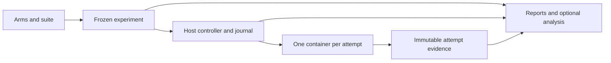

# Campaign consolidation: one execution model, useful comparisons

**Date:** 2026-09-04
**Status:** direction approved by Drew after the five-reviewer architecture
audit; detailed design written for review. Implementation has not started.
**Scope:** consolidation of the campaign kernel and appliance V2 roadmap.
**Source baseline:** main `f8e1889c`; appliance work `65c28448` on
`drew/child1-tasks-15-17-recut`. Recorded tests and live runs are evidence
from those sources, not verification repeated by this design exercise.

## Decision and precedence

Keep the arm, suite, sample, attempt, and immutable-evidence model. Use one
host campaign controller and one container per attempt. Simplify the
controller's persistence and ownership boundaries before adding features.
The deliverable is a comparison an operator can configure, run, inspect,
and understand without a custom driver or result extractor.

This is the accepted forward direction for the remaining campaign work:

| Earlier direction | Disposition |
|---|---|
| Platform revision 3: comparative questions as configuration; human release judgment | Retain. |
| D1-D4a implementations and their historical artifact contracts | Preserve as the explanation of V1 behavior and evidence. |
| V1-specific D4b gating seal, adjudication, and operator integration | Pause. Do not build a second supported campaign lifecycle on the format V2 retires. |
| Appliance V2: host controller, isolated attempts, measurement-only cost | Retain, subject to the consolidation decisions below. |
| V2's four-child sequence and its durable-contract details | Replace where they require duplicate authority or independently committed fragments of one internal transition. The delivery sequence below governs consolidation planning. |
| Separate formal qualification campaign and automatic release authority | Remain retired. Required executor verification still applies. |

The detailed contract requires written review before implementation planning.
This document authorizes no deployment, artifact migration, deletion, or paid
run. Existing V1 behavior does not change merely because its roadmap changes.

Three approaches were considered. Continuing the current additive roadmap
preserves two incompatible destination products. A wholesale rewrite repays
working provisioning, capture, eligibility, and evidence contracts. The chosen
approach reuses those components and changes the boundaries that currently
manufacture recovery work or duplicate decisions.

## Product boundary and ownership

The supported campaign product runs on one Linux appliance for trusted
maintainers, with one live campaign per appliance and parallel attempts inside
it. It supports the existing model/credential, agent, scenario, and
superpowers-ref-or-none comparison axes where adapters declare support.
Adding per-arm grader treatments or selectable harness executable versions is
outside this consolidation. Record observed versions without inventing new
treatment dimensions.

| Responsibility | Owner and boundary |
|---|---|
| Experiment intent | Frozen registration: expanded sample/block inventory, input identities, execution limits, and measurement policy. |
| Admission, cancellation, replacement selection | One controller; durable decisions in one SQLite journal. Dispatch and recovery share the event fold. |
| Process existence | Container runtime, checked against journaled identities. A dead controller does not establish dead attempts. |
| Credentials | Host projector stages exactly the subject and grader credentials for an attempt. Workers cannot read the host bundle or sibling attempts. |
| Observations | Immutable attempt artifacts with identities, manifests, and explicit missingness. |
| Campaign status | Read-only projection of registration, journal, and observed workers; no second lifecycle in appliance job records. |
| Command invocation | Appliance job receipt: command, controller identity, timestamps, and command result. |
| Interpretation | Deterministic reports over evidence; an optional later decision function has no execution authority. |

Preserve the existing quorum -> Gauntlet -> private tmux -> Coding-Agent
chain inside each container. Subject and grader remain cooperating components
within an attempt; separate credential files do not create a security boundary
between them. Retain host-only Docker access, private attempt mounts, exact
credential projection, and the existing worker hardening requirements.

Direct `quorum run` and `run-all` remain development workflows. Campaign
dispatch does not invoke the run-all scheduler. Workstation development must
use real platform-appropriate preflight and retain host exclusion, credential
scoping, and honest provenance; it must not require Linux test fixtures or a
forged covered-child marker. Campaign evidence still comes through the
appliance path. There is no campaign-on-macOS implementation in this scope.

## Execution and persistence

**Compile resource policy once.** Resolve credential aliases through the
existing pool identity and freeze one capacity/spacing map at registration.
Declarations in the frozen registry sharing an active pool contribute their
explicit limits: minimum concurrency, maximum launch spacing. An active pool
with an unspecified concurrency limit is a registration error. Feasibility
and dispatch consume the same map and the same complete demand vector,
including both subject and grader use when they share a pool. Per-key limits
remain subordinate constraints. No phase chooses the first matching arm or
invents a different default.

**Bound work directly.** Freeze finite planned samples, replacement/reserve
allowances, attempt-count limits, and per-attempt execution limits. A new
attempt always consumes a new attempt number and the applicable allowance;
crash recovery cannot reset those limits. Behavioral failure does not purchase
a replacement. Recovery requires an explicit operator `run`; permitted
automatic retries during that invocation follow the frozen failure policy.

**Commit internal transitions atomically.** Ordered event rows remain the
audit record, but one SQLite transaction commits one indivisible transition:

- block admission and all of its attempt intents;
- replacement identity, reserve activation, and predecessor dispositions;
- acceptance of a terminal observation and its dependent evidence references.

Validate the entire group before committing; update the in-memory projection
only after commit. On failure, roll back the group. Keep standalone observations
as separate transactions where they do not depend on an accompanying record.
Retain writer exclusion and fencing. No database transaction spans a provider
call, container operation, or filesystem publication.

**Keep the real external-effect boundaries.** The following order is required:

1. Allocate attempt, run, output, and deterministic container identities;
   durably record execution intent before `docker create`.
2. Create and inspect the container; durably bind its immutable runtime ID
   before `docker start` can authorize provider access.
3. Execute the existing runner with private inputs and outputs.
4. Preserve logs and partial evidence on exit; verify the worker manifest and
   publish immutable results before recording their accepted journal binding.
5. Verify complete container death before releasing execution capacity or
   starting a replacement.

Recovery reconciles a prepared identity without a container, a created but
unbound container, a bound but unstarted container, and published but
unjournaled evidence. Discovery uses exact labels and verifies the complete
expected identity/specification; a label alone is not authorization. Ambiguous
ownership or unverified death yields `recovery_required` and stops admission.

Cancellation persists intent before signalling and reaches every owned worker.
`cancelled` requires verified worker death and durable campaign cancellation.
An invocation that stopped without that proof reports an interrupted command
and unresolved campaign state. Storage exhaustion stops admission and all owned
workers, verifies their death, then preserves bounded control evidence using
the existing emergency-reserve mechanism. `storage_paused` requires verified
worker death and durable pause evidence; otherwise report `recovery_required`.
Status never repairs or starts work. Host exclusion remains effective while an
old worker could live.

**Separate execution from analytical inclusion.** A planned sample is a slot
in the experiment. An attempt has its own execution outcome. A disposition
states whether an observed attempt contributes to that slot and comparison.
Completing an attempt never becomes "admitted" again. Replacement creates a
new attempt and explicit lineage; it does not rewrite the predecessor's
outcome. At most one selected attempt supplies a sample slot, and pairing
selects one coherent block instance. Excluded observations remain readable.

## Measurement and reports

V2 has no dollar admission, dollar stop, or budget amendment. Missing price
does not stop behavioral measurement. Costs include every observed attempt,
including excluded, failed, retried, and replacement work. Unpriced or missing
usage is explicit; a known subtotal is never labeled a complete total. Finite
work limits do not promise a dollar ceiling. Estimates remain optional
planning information and cannot authorize additional attempts.

The shared measurement input contains only what execution and reports need:

| Record | Required information |
|---|---|
| Arm | Stable identity; requested agent/model/endpoint and skill ref or absence; frozen configuration and instrument identities. |
| Planned sample | Scenario/check identity, arm, replicate, comparison and block membership. This inventory supplies denominators for work that never starts. |
| Attempt | Sample/attempt IDs, timestamps, execution status and typed cause, observed versions/models, artifact references/digests, separate Gauntlet-Agent and deterministic judgments, subject/grader usage and cost with missingness. |
| Disposition | Inclusion/exclusion or replacement selection, reason, and predecessor/successor references. |

Reports distinguish planned samples, executed attempts, usable outcomes, and
fully observed pairs. The first supported report contains:

- Per-arm, per-scenario pass/fail/indeterminate/unobserved counts and completion
  shares over planned slots, plus total attempt counts.
- Descriptive per-arm pass rates over usable determinate outcomes. The primary
  comparative delta uses complete determinate pairs from the same selected
  block instances; show the pair count separately. No silent switch between
  independent-arm and complete-pair denominators.
- Per-arm wall-time and subject/grader cost summaries for those comparable
  pairs, with a separate contributing count for each quantity. Missing price
  can remove a cost observation without removing its behavioral observation.
- Observed total cost by arm and across all attempts, cost coverage, and
  discarded-work cost separate from the comparable-pair summaries.
- Exclusion/replacement reasons, Gauntlet-Agent versus deterministic-check
  disagreements, provenance caveats, and links to the underlying artifacts.

Use existing captured fields; extend capture only where a required quantity
is absent. Do not introduce a second token-accounting implementation. Duration
definitions are explicit: attempt wall time includes runner setup/drive/capture;
campaign elapsed time is reported separately.

Sealing anchors immutable measurement data, inclusion decisions, and the
versioned report fold. Missing costs can coexist with complete behavioral
execution. Cancelled or abandoned campaigns produce explicitly incomplete
readouts. Sealing never certifies that the scenario's checks match its intent.
Human formatting is derived from canonical data; changing presentation does
not reinterpret or invalidate that data.

An optional future decision module consumes these same rows and explicit
analysis parameters. Parameters for a pre-registered analysis are frozen
before execution; later analyses are labeled exploratory. It writes a separate
immutable analysis result referencing the evidence digest, never runtime
events or replacement decisions. Fisher/MDE/tripwire policy, generic errata,
and adjudication tooling are outside the first consolidation delivery.

## Operator workflow

The supported entry point is `evals-appliance campaign`. Each verb delegates
to the same controller/read model; a second raw-CLI recovery procedure is not
part of the product.

| Verb | Operator-visible result |
|---|---|
| `register` | Expanded comparison, eligibility exclusions, finite work limits, pinned inputs, and accepted campaign identity. Prices are optional information. |
| `list` / `status` | Campaign lifecycle, progress, observed cost coverage, blockers, and one explicit next action. Running status contains no behavioral outcomes. |
| `run` | Start or reconcile/resume the selected campaign; never silently start paid work after host restart. |
| `cancel` | Persist cancellation and establish worker death, or state precisely why cancellation remains incomplete. |
| `costs` / `report` | The same measurement projection, with mid-run costs or the terminal comparison respectively. |
| `abandon` | End an unrecoverable campaign only after worker death is established, preserving incomplete evidence. |
| `cleanup` | Preview a positive deletion list; apply only that reviewed plan while preserving verified evidence and required inputs. |

One concise runbook owns this journey. No dashboard controls, fleet, queueing
service, automatic resume daemon, or general analysis plugin framework is added.

## Deletion and retention ledger

These are implementation obligations, not permission to delete current code
before its replacement exists. Existing files contain shared functions; remove
the named responsibility, not the entire file by default.

| Remove or collapse | Replacement and deletion condition |
|---|---|
| V1-specific D4b seal/adjudication integration | Do not implement it. Preserve the draft as historical planning; optional analysis uses the surviving measurement contract. |
| Campaign budget object, budget stops/amendments, in-flight dollar exposure and its recovery | Remove from new V2 contracts and execution together. All-attempt cost/missingness reports must work first. |
| Per-event commits within indivisible transition groups; corresponding partial-prefix/suffix repair | Atomic groups pass failure-cut tests. Old V1 prefixes remain the old reader's responsibility. |
| Separate event-routing mirrors in dispatch and replay | One shared incremental fold. Reporting may retain a distinct pure projection. |
| Registration/runtime pool-cap derivations | One frozen policy map and demand calculation, proven invariant under credential/arm ordering. |
| Combined sample execution/exclusion/reentry state machine | Immutable attempt outcomes plus explicit slot/block dispositions and replacement lineage. |
| Appliance job records claiming campaign completion/cancellation | Invocation receipts plus journal/worker-derived campaign status. |
| Host-direct process-group/tmux recovery as an appliance campaign backend | Exact container reconciliation and verified namespace death. Keep process support still used by direct development runs. |
| Pooled-only report counts/economics and routine scratch extractors | Canonical per-arm rows, complete-pair comparisons, and all-attempt costs. |
| Linux appliance-only preflight imposed on workstation development | Real platform-specific development checks, preserving exclusion and provenance. |
| Empty tags/metrics sections, generic errata, duplicated statistical implementations | No current consumer; do not add them to consolidation. |
| Multiple live V1/V2 controller implementations after cutover | One V2 runtime; archive the V1 checkout and evidence for read-only historical use. |

Retain scenario checks/manifests, provisioning, agent adapters, capture/ATIF,
cost estimation primitives, eligibility, frozen snapshots, failure
classification, whole-block admission, credential scoping, writer fencing,
host exclusion, evidence manifests, and appropriate telemetry. Retain the
run-all scheduler for its distinct development workflow. A smaller file count
or a renamed module is not evidence of simplification.

## Delivery and acceptance

Deliver three bounded increments, each with its own implementation plan after
this design is reviewed. Their scope is fixed here; detailed task breakdowns
must name the exact code removed and the behavior replacing it.

1. **Prove attempt ownership.** Complete the existing container seam's
   prepare/bind/start, evidence publication, cancellation, and reconciliation
   behavior. Exercise it with the real runner and a local fake provider on
   Linux. Add only the transition support needed for that proof; no new V1
   decision or budget features. Reuse the resulting worker boundary in V2.
2. **Consolidate the model.** Implement atomic control transitions, shared pool
   policy/fold, separate attempt/disposition state, and the measurement/report
   contract as one coherent V2 format change. Remove the corresponding V1
   responsibilities from the new path. Demonstrate a paired comparison and
   interrupted recovery through the helper with useful per-arm output.
3. **Finish the operator cutover.** Complete the single command journey,
   durable paths, credential-generation integration, and evidence-preserving
   cleanup. Drain V1 activity, verify worker absence and retained evidence,
   then retire V1 execution on the appliance. Archive the old checkout and
   artifacts without translation; V2 rejects them and never resumes them.

Do not move or convert old artifacts during development. Historical read-only
tools stay separate from V2, with no compatibility reader added to its runtime.
The existing V1 gating campaign that cannot seal remains documented incomplete;
consolidation does not relabel it sealed. Cutover and any live paid verification
remain separately authorized operational work.

Required evidence is specific rather than a new qualification program:

| Check | Passing evidence |
|---|---|
| Configuration usability | A maintainer expresses a supported comparison and accepts registration in under 30 minutes with no `src/` edits. |
| Atomic transitions | Failure before/after commit leaves the whole admission/replacement present or absent; no partial internal bundle needs repair. |
| External crash cuts | Interrupt before create, after create/before binding, after binding/before start, after result publication/before journal acceptance, and during cancellation. Repeated recovery creates no overlapping replacement, duplicate inclusion, or unowned worker. |
| Storage exhaustion | Fail durable writes while workers are active. Admission stops, exact owned workers are stopped and verified dead, and a durable pause or explicit recovery-required condition remains; no false completed pause is reported. |
| Finite work | Repeated interruption and recovery never replenish attempt limits or reserve allowances; exhaustion produces explicit missing evidence without further admission. |
| Resource policy | Reordered aliases/arms produce identical capacity decisions; shared subject/grader pools obey the same complete demand vector during registration and execution. |
| Cost independence | Unknown price permits the behavioral comparison, reports incomplete cost coverage, and never changes admission or inclusion. All observed discarded-attempt costs remain visible. |
| Honest reports | Mixed determinate/indeterminate, never-started, excluded, and retried fixtures yield exact per-arm and complete-pair denominators; disagreements remain visible. |
| Operator semantics | Controller death alone never yields campaign cancellation/completion; status explains the action needed. The supported verbs suffice without journal surgery. |
| Development workflow | Supported workstation smoke remains usable with real platform checks and no fabricated test environment. |
| Preservation and removal | Historical artifacts retain their digests; V2 has no runtime V1 reader, dollar-control path, duplicate campaign authority, or partial-internal-transition recovery. |

Portable tests establish contracts; Linux container integration establishes
the execution boundary; an authorized small appliance run establishes the
installed path. Record failures as well as passes. A simulated eight-hour
release workload remains a capacity prediction until measured on the actual
mix; the recorded 121-minute sentinel campaign is not that measurement.

Stop expanding the design if the isolated executor still needs overlapping
state machines to pass these cuts, or a supported comparison still needs
source changes. Those are grounds to reconsider the boundary. Source size
and review fatigue alone are not grounds for a wholesale rewrite.

## Evidence and implementation anchors

Paths below are repository-relative and line numbers refer to the source
baseline above. Branch-only evidence can be read with `git show <commit>:<path>`.

| Evidence | Source |
|---|---|
| Configuration/ceremony objective | `docs/superpowers/specs/2026-08-17-quorum-campaign-platform-design.md`, lines 79-98 |
| Historical reason to keep validity and trim availability scope | `docs/experiments/2026-08-17-platform-direction-panel.md`, lines 31-75 |
| Real comparison throughput and remaining capacity limits | `docs/experiments/2026-09-04-multiharness-signature.md`, lines 130-152 |
| Per-event transactions and their repair burden | `src/campaign/journal.ts:393`; `src/campaign/dispatcher.ts:1773`; `src/campaign/recovery.ts:2117` |
| Divergent pool policy | `src/campaign/registration.ts:645`; `src/campaign/dispatcher.ts:1279` |
| Execution and disposition conflation | `src/contracts/campaign/state-machine.ts:11` |
| Report arm/duration gaps and actual extractor | `src/campaign/report.ts:649`; `src/campaign/report-evidence.ts:17`; `docs/experiments/2026-09-02-opus5-signature.md:242` |
| V2 scope and existing child boundaries | `65c28448:docs/superpowers/specs/2026-09-02-campaign-appliance-v2-design.md`, lines 7-61 and 1435-1482 |
| Container start before returned handle; helper cancellation semantics | `65c28448:src/campaign/container-spawner.ts:301`; `65c28448:src/appliance/process.ts:1566` |
| Latest recorded Linux obstruction | `65c28448:.superpowers/sdd/2026-09-03-campaign-appliance-v2-child1-tasks-15-17-recut/task-1c-report.md`, lines 337-350 |

The untracked `2026-09-04-kernel-d4b-decision-readout-design.md` inspected
during the audit proposed V1-specific gating integration. It is not a shipped
capability or an implementation dependency of this design.
