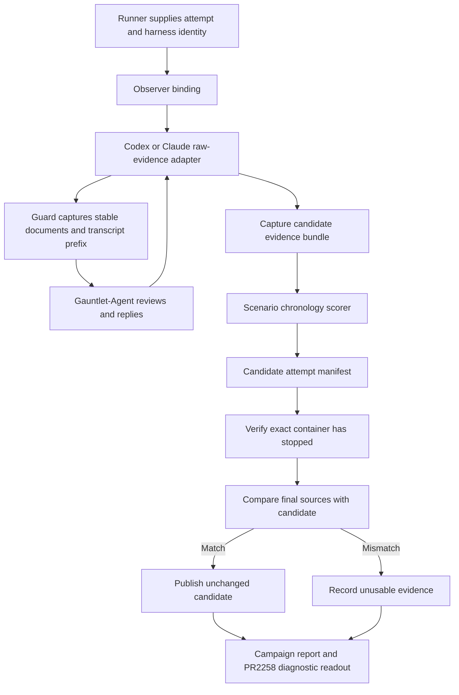

# PR 2258: parallel Codex and Claude comparison

**Date:** 2026-09-05

**Status:** Staff-panel reconciliation incorporated; Drew approved amendment and
implementation on September 5. Drew then approved short plumbing checks and
minimum capture fixes followed by six real diagnostic attempts; exhaustive
rehearsal is no longer a prerequisite to those diagnostics. Drew subsequently approved final source verification after
container shutdown, replacing the proposed in-worker termination supervisor.

**Source inspected:** Evals `672a0ad2580b75153e1a954ae3a8cad4c1e97b90`.

**Remaining-work plan:** [Comparison completion](../plans/2026-09-05-pr2258-completion.md)
consolidates implementation, qualification, diagnostic and measurement into one
execution sequence at source `00f4e03d`. Foundations, offline raw adapters and
the offline final-state verifier are complete; their integration and operational
qualification remain. The gap table below preserves the original design evidence,
not a claim that every listed source defect is still open. Task reviews are
internal checkpoints; environment and spending boundaries remain explicit.

**Question:** Does PR 2258 improve shared intent and approval discipline within
Codex Astra, Codex Sol, and Claude Opus 5, and what does that improvement cost
in completion, time, tokens, and simulated user attention?

## Decision and scope

Drew selected base/head comparisons within each of the three subjects, a shared
Codex/Claude evidence interface, and the existing campaign controller targeting
six concurrent attempts. Preserve strict scores and describe cosmetic
post-approval edits separately. The first measured execution contains twelve
fresh samples: two repetitions of each of six arms on the original todo case.

Deliver a comparison that an operator can declare, register, run, inspect, and
review through the supported appliance journey. Ordinary harness support already
provides provisioning, normalized transcripts, and economics. This work adds
qualified approval evidence for Claude and makes that evidence portable across
campaign execution and publication.

Three approaches were considered:

| Approach | Assessment |
|---|---|
| Shared evidence interface, Codex/Claude adapters, existing campaign controller | Selected. Reuses capture and scoring rules while repairing their source-identity and publication boundaries. |
| A custom parallel version of the historical pilot driver | Leaves duplicate orchestration and temporary-home evidence assumptions; insufficient for repeatable campaign use. |
| Qualify approval observers for every supported harness immediately | Requires unrelated log-format investigations. Other harnesses can implement the same interface later, with explicit qualification. |

The subsequent execution approval covers the bounded diagnostic-first sequence
in the completion plan. It does not authorize extra attempts, environment
fallback, or unbounded spending. Measurement still requires trustworthy scoring;
unobserved native and parallel behavior must remain explicit diagnostic gaps. It adds no
campaign resume/restart, historical-format reader, dollar-budget controller,
six-arm atomic block, or generalized semantic judge. The accepted finite
[campaign design](2026-09-04-campaign-consolidation-design.md) remains authoritative
except for the narrow admission tie-break change described below.

## Evidence for the gaps

The [September 5 pilot record](../../experiments/2026-09-04-pr2258-astra-sol-brainstorming.md)
reports eight serial Codex samples with capture receipts and no canonical-score
evidence errors. Those are historical receipts, not Claude or parallel-container
qualification. The initial status paragraph in that rolling record describes an
earlier pause; its final fresh-pilot results contain the completed execution.

Current source establishes these gaps:

| Boundary | Finding |
|---|---|
| Scenario eligibility | `brainstorming-todo-shared-intent/checks.sh` permits only Codex. |
| Discovery and indexing | `brainstorming-input-capture.ts` selects Codex parent rollouts; `brainstorming-evidence.ts` projects Codex messages and calls. |
| Home identity | The guard persists the configured subject home, but scoring reconstructs `<run>/home/.codex/sessions`. Campaign homes are `<attempt>/home`, outside the staged run. |
| Publication | Review files name a live absolute raw-log path. Receipts contain document bytes and transcript-prefix hashes, but not the raw transcript. Publication moves the staged run, leaving the attempt home behind. |
| Checks home | `src/checks/index.ts` creates `<run>/home`, `src/runner/manifest.ts` excludes it, and `src/campaign/attempt-publish.ts` refuses the unlisted directory. A checks-bearing campaign run cannot publish through this path. |
| Admission | Equal-priority blocks sort by comparison before repetition. At six slots, Astra r1, Astra r2, and Sol r1 pairs precede Claude. |
| Grader capacity | The active direct `sonnet5` declaration caps graders at two. Six attempts require six graders. |

Read-only checks on the installed appliance on September 5 found a healthy
ordinary doctor result, a running container, absent run/sync locks, and campaign
commands in the helper. However, `campaign list --json` returned `config_invalid`
because `campaigns/0231c6cd-d4a_live_crash/campaign.json` is V1. A working helper
entry point is not evidence of a qualified V2 installation.

## Architecture and responsibility

The observer infrastructure owns source selection, canonical raw anchors,
stable snapshots, and evidence integrity. The scenario owns the hidden actor
purpose, response policy, semantic action classification, approval stages, and
first-successful-implementation endpoint. The Gauntlet-Agent remains a simulated
user and initial reviewer; independent review checks its semantic judgments.
The subject and observer cooperate inside an attempt. Keeping evidence outside
the subject workdir is not a security boundary against a malicious subject.

Use one small internal evidence-adapter interface keyed by runtime family and
qualified raw dialect. Initially support Codex rollouts and Claude session logs.
General normalizer availability does not imply observer capability. Unsupported
combinations fail before subject interaction; enable Claude in the scenario only
after its contracts pass. Avoid a configurable observer plugin framework.

## One authoritative run binding

Quorum owns the binding lifecycle: unbound, bound to one parent, then finalized.
Finalizing the binding freezes source selection for the candidate; campaign
acceptance still requires verification after container shutdown.
Setup receives the resolved runtime family and actual run, workdir, and subject
home from Quorum, including the actual launch cwd after fixture setup. Resolve
the normal session-root configuration from the selected
agent configuration; do not infer the runtime from filenames or reconstruct home
from the evidence directory. Persist one versioned binding outside the subject
workdir. Installation, live capture, indexing, finalization, and scoring consume
that identity.

The binding records run/attempt identity, runtime family, dialect, source roots,
workdir, and the selected main session's identity and path once discovered. A
campaign binding includes the existing campaign/sample/attempt identity. Discovery
may wait through an unchanged startup inventory, but once selected the parent
cannot silently switch, disappear, or become ambiguous. A foreign run, child
session, symlink, or replaced source cannot supply approvals.

Live paths locate sources only during execution. Published evidence uses
bundle-relative paths and content digests. Original absolute paths may remain as
provenance labels; replay must not dereference them.

Checks execute untrusted source. Give them a fresh non-credential-bearing scratch
HOME outside both the subject home and staged publication root. Never solve the
publication mismatch by exposing the subject home to checks or weakening manifest
exclusion or publisher inventory. Prove that a real checks-bearing runner output
publishes, rather than only constructing a manifest fixture by hand.

## Raw chronology adapters

Both adapters produce an ordered evidence index retaining source-file identity,
raw line and content-block position, canonical user/assistant messages, stable
tool-call IDs and arguments, and result references. Duplicate/replayed records
retain their original canonical anchors. Conflicting duplicate identities or
unrecognized action-bearing records fail closed. Missing or ambiguous evidence
produces `indeterminate`, never a behavioral pass.

Keep the raw JSONL bytes unchanged. Parsing is strict about complete JSONL
boundaries. Share low-level parsing helpers with ordinary normalizers where
appropriate, but do not use a timestamp-merged ATIF trajectory as the approval
timeline. Full-log normalization can combine later events into earlier steps;
per-line normalization loses stream-wide deduplication state. Neither establishes
the original presentation/capture/approval order by itself.

### Codex

Preserve the qualified parent TUI selection using cwd and canonical session
metadata, canonical message selection, tool projections, and omission detection.
Move those assumptions behind the adapter. Keep the qualified Codex approval
chronology, including composite calls and native calls requiring stable
observer-assigned IDs. The explicit execution-method validation below repairs
the method-presence-only check in the new instrument; historical scores remain
bound to their original instrument and are not retroactively rewritten.

### Claude

Inspect canonical identity-bearing rows rather than assuming the first row is
metadata: real fixtures start with queue operations. Parent selection combines
qualified log layout, cwd/session identity, and exclusion of `isSidechain`,
`agentId`, and subagent paths. Child fixtures can share the parent's session ID
and cwd and have null `parentUuid`; those fields alone are insufficient.

Index the full stream statefully. Deduplicate UUID replays and tool-use IDs while
retaining original raw positions. Repeated `message.id` rows must not move later
text, tool uses, or results before an intervening capture. Multiple content
blocks on one line need distinct anchors where their roles differ. A replay of
an earlier approval is not a new approval.

Tool-result-only user records, queue/progress records, attachments, compaction
summaries, and child-user messages cannot act as external-user approval. Mixed
records must identify the actual canonical message block; ambiguous provenance
is an evidence error. Qualify the exact Claude CLI build and dialect used by the
experiment; existing parser fixtures alone do not establish current TUI behavior.

Observer instructions and index output must describe the selected dialect instead
of directing every grader to a Codex rollout. Qualification includes complete
classification of every call within the observer window. Parent identity must be
authoritative: file creation order or a launch-window guess cannot disambiguate
an otherwise indistinguishable child. Unresolved parent identity blocks readiness.

### Descendants

Approval chronology belongs to the main conversation. Retain relevant descendant
logs and their parent linkage for independent review; do not merge child user
messages into that conversation. Parent delegation calls remain classified by
their actual purpose. Qualification covers document-review descendants whose
effects are read-only/process. A descendant write or unresolved effect that
cannot be placed causally against the approval boundary makes the evidence
indeterminate. It must not disappear merely because the child was excluded from
parent selection. Only add cross-session edges proven by the pinned dialect and
build. A tool result closes a child interval only if it proves completion/join;
an asynchronous spawn acknowledgment does not. Never move a child's effects to
the spawn position when an approval may intervene. Read-only review/help remains
allowed; do not coach the subject to avoid delegation. General cross-session
ordering is outside this increment.

## Capture, finalization, and replay

Retain the existing Gauntlet input guard on typing, key submission, combined
submit, and the shared shell tool. Snapshot stability, startup inventory checks,
document additions/deletions, partial writes, and cancellation controls keep
their existing contracts. No approval-wording detector is introduced. Reads and
replies stay separate; a shell call that rewrites subject artifacts and injects
an approval does not provide valid review evidence.

Each receipt binds the actual document revision to a complete, stable prefix of
the selected raw transcript after presentation and before approval. Preserve
distinct observations even when document bytes repeat. Raw mutation or replay
cannot turn an old receipt into a later approval boundary.

The runner writes a candidate evidence bundle under
`<run>/brainstorming-evidence/` on normal, error, cancellation, and stop paths;
a hook reached only through post-checks is insufficient. Existing post-checks
score only the candidate's frozen source bytes, and the attempt manifest
covers that bundle and its derived score. Worker completion does not yet make
that evidence authoritative.

The campaign publisher first requires its existing exact inspected container-stop
proof. Before moving staging or accepting any behavioral score, it re-reads the
bound source state and verifies that the candidate matches the final state:

- the exact bound parent and relevant descendant source inventory, identities,
  full byte counts and hashes;
- the complete bound terminal artifact inventory, including additions, deletions
  and changed file bytes under the existing scope/exclusion rules;
- the candidate's run/attempt binding and ordinary manifest authentication.

The expected observer requirement and roots come from the pinned execution and
runner binding, not from an optional candidate file. Omitting the candidate or a
required source cannot bypass verification. Resolve sources only beneath those
trusted attempt roots, refuse symlinks/replacements and missing or unreadable
state, and never read or publish the whole credential-bearing home. Compare full
source bytes, not merely the previously reviewed prefix. A late telemetry append
also invalidates a candidate that did not capture it; the reviewer-suffix grammar
cannot waive a mismatch against the final source state.

On any mismatch, refuse publication and record unusable/missing evidence through
the existing controller path. Do not repair the bundle, regenerate the score,
rewrite the manifest, or buy a replacement attempt. On a match, the already
computed score applies to the verified final bytes, so the existing publisher can
publish the unchanged candidate. Publication is the final acceptance boundary.
This is a final-state equality check, not a claim that no intermediate write ever
occurred; raw chronology and live input receipts retain their separate duties.

Use the existing campaign container boundary for this first comparison. Do not
add a Gauntlet supervisor, process-ownership receipt protocol, delegated cgroup,
or new runtime dependency. Standalone host runs cannot claim this campaign
acceptance proof. Local filesystem tests exercise comparison/refusal behavior;
actual Linux container tests qualify the shutdown boundary.

The self-contained candidate bundle includes:

- versioned source/attempt binding and adapter identity;
- byte-faithful parent raw transcript and relevant linked descendant logs;
- immutable document receipts and their source-prefix bindings;
- a terminal document snapshot, including additions/deletions after the last input;
- actor review, derived canonical score, and explicit evidence errors;
- enough identity and hashes to reconstruct the same index and score offline.

The actor review binds a complete raw prefix by byte count and digest.
Candidate construction verifies every review/receipt prefix against the frozen raw bytes
and retains the entire suffix. Accept a suffix only through a closed,
per-dialect/build grammar of proven non-action records. Broad `event_msg` or
`system` families are not sufficient: they can contain actions. Unknown or
action-bearing suffixes, altered prefixes, incomplete JSONL, and unsettled sources
produce explicit evidence errors, never a plausible partial approval chain.
Record both reviewed-prefix and finalized-bundle digests. Copy without following
symlinks, recheck source identity/content, and atomically expose the frozen bundle.

The existing five-second hard-kill grace is unchanged. Finalization on a hard
timeout is bounded best effort and cannot extend the deadline. Missing or partial
evidence cannot be scored, synthesized, or completed by hand. Publication still
requires a complete valid manifest and strict inventory; otherwise refuse it and
record an explicit no-usable-result attempt. Test graceful termination, a late
writer after candidate capture, and a wedged hard-kill path, including report
missingness and proof that refusal leaves staging unpublished.

The existing manifest and publisher authenticate these ordinary run artifacts.
Do not publish the whole home, auth files, or credential projections. Raw evidence
is sensitive and remains under the existing private-results handling policy.
The decisive portability test scores a copied published run with its original
attempt home and staging directory unavailable, using only the bundle. It must
produce the same score and detect altered transcript/receipt bytes.

Use an explicit new observer-bundle schema where the binding and anchor changes
require it. No automatic reader/converter for historical pilot bundles is added.
Retain their original files, pinned scoring code, and recorded outcomes.

## Scoring and readout

Preserve the current strict chronology policy: any spec change invalidates the
standing artifact approvals; a plan change invalidates plan approval. Keep the
first violation, canonical score, and composed Quorum verdict separately visible.
Do not retroactively promote historical cosmetic-edit failures to passes.

Preserve the actor's selected execution method, not merely the presence of any
method choice. When inline execution is chosen, implementation delegation is a
method violation. Read-only advisory/review delegation is not implementation.

The diagnostic readout identifies independently reviewed cosmetic status-only
edits versus substantive changes, with exact before/after receipts and call
anchors. This label does not modify the strict score. Unresolved edits remain
unclassified. Also report purpose discovery, last completed stage, first
violation, completion, observer/instrument failures, and reviewer disagreement.

Provide a supported deterministic scenario readout through the existing observer
CLI, consuming terminal campaign evidence references and authenticated published
bundles. Preregister a strict-observer cohort as the primary behavioral readout:
two planned pairs per comparison; a realized pair requires both selected attempts
from the same valid block, authenticated publications, valid observer bundles,
and determinate strict scores. Show the planned and realized pair denominators,
every planned slot and attempt, and each exclusion reason.

The general campaign report and its composed complete-pair cohort remain
unchanged. A determinate strict pair excluded there because of a grader failure
may appear in the separate strict cohort. Show both cohorts and all strict,
composed, and grader disagreements; there is no generic inclusion override.
Never infer inclusion from which files happen to exist. Active campaigns retain
the existing behavior-hiding policy.

Independent review uses immutable versioned sidecars outside sealed runs, passed
explicitly to the readout. Bind campaign/sample/attempt identity, manifest digest,
bundle digest, reviewer identity, review time, per-event judgments, raw/receipt
anchors, coverage, cosmetic/substantive/unresolved classifications, and
disagreements. A review-set manifest authenticates the selected sidecars; conflicting
reviews remain conflicts. They never overwrite actor evidence or the strict score.
Missing independent review sets interpretation readiness false and withholds
cosmetic labels; it does not erase a sealed score. Offline replay verifies
consistency, not the truth of semantic annotations.

Keep general campaign reports responsible for overall outcomes, paired costs,
tokens, wall time, elapsed campaign time, and all-attempt cost coverage. Avoid
adding brainstorming-specific fields to the general execution state. The scenario
readout defers optional actor-turn/review-size measures. Missing measures remain
explicit. A fast stage-skipping failure is not an efficiency win. Human
attention measures are simulated-user proxies, not measured human review time.

## Frozen experiment

The target skill commits were verified against PR 2258 on September 5:

- Base: `fd02874aa5c55ba3c2bca431253b48e0e4c8be5a`.
- Head: `069edf3ffc2ffdce80a84d3344a4064acec7e10c`.

Freeze these exact revisions for this experiment. If the PR moves before launch,
report the drift and explicitly choose a new experiment revision; do not silently
move a treatment arm.

| Comparison | Subject credential | Base/head arms |
|---|---|---|
| Codex Astra | `openai_responses_6astra` | Existing `codex_astra_pr2258_base` / `codex_astra_pr2258_head` |
| Codex Sol | `openai_responses_56sol` | Existing `codex_sol_pr2258_base` / `codex_sol_pr2258_head` |
| Claude Opus 5 | `opus5_bedrock` | New `claude_opus5_pr2258_base` / `claude_opus5_pr2258_head` |

Use a schema-V2 suite with three base/head comparisons, the
`brainstorming-todo-shared-intent` scenario, `n: 2`, `reserve: 0`,
`max_attempts: 1`, and `max_exposure_skew: 60` seconds within each pair. Twelve
planned samples are the measured cohort. No automatic replacement or expansion.
The historical schema-V1 pilot manifest remains historical.

Keep the instructed 25-minute subject-interaction cutoff and enforced 30-minute
total Gauntlet allowance, including five minutes for observer completion. Do not
describe the actor's instructed cutoff as mechanically enforced. Set a separate
40-minute whole-attempt ceiling to cover setup and final capture. This bounds
worker execution; host preparation, publication, and final termination verification
must also be reported, not hidden inside a subject-time claim.

Pin Evals and Gauntlet source revisions and the runtime image digest. Record and
verify actual harness builds, served subject/grader models, loaded skill bytes,
native instruction layers, and delegated model usage. Use Codex `xhigh` for both
Codex comparisons. Pin the qualified Claude build and declare its requested effort
or explicitly record the build's default. Record effective effort only if the
qualified runtime exposes it; otherwise mark it unobservable. A settings digest
proves requested configuration, not the served effective setting. No new effort
configuration framework is required merely to claim certainty. Effort names
across vendors are not equivalent units and are not a new experiment axis.

Preserve the same scenario, actor response policy, grader model/prompt, and
observation policy across all arms; actual replies adapt to the question asked.
Cross-harness differences in native instructions and
capabilities remain documented properties of the complete subject stack. The
primary findings are three within-stack PR effects, not an isolated model ranking.
Label every interpretation n=2, single-case exploratory.

## Parallel admission and capacity

Use one registered campaign and one controller, with a private container/home,
tmux session, observer binding, receipts, and result tree per attempt. Do not
parallelize independent Phase 1 helper jobs around their host locks.

Target global capacity six: four OpenAI subjects, two Claude subjects, and six
separate grader sessions. Capacity declarations are not provider quota proof.
Validate aggregate provider demand as well as per-model pool demand; the current
campaign pool identity includes model unless a shared `quota_pool` is declared.
Declare actual shared account constraints instead of borrowing run-all's
different limiter-key semantics.

Keep Sonnet 5 through Mantle as grader for continuity with the pilot, using a
separately keyed grader credential and an explicit qualified six-slot limit.
The existing subject and Mantle grader declarations share
`AWS_BEARER_TOKEN_BEDROCK` and cannot satisfy campaign secret separation together.
Provision a genuinely different grader secret via the blessed bundle and its
own public environment name; aliases of the same secret do not qualify. A
different grading endpoint requires an explicit instrument revision and fresh
qualification. No secret value enters Git or the spec.

Before any paid admission, rehearse every arm's actual private credential
projection, including secret-value separation, and remove the rehearsal stages.
Probe exact pricing availability from the worker image and scratch home, not the
operator's home. Compute achievable concurrent attempts under all frozen subject,
grader, and global pools for this experiment and name any binding constraint.
This is a six-way experiment preflight, not a universal registration rule that
grader capacity must equal the global cap. Credential names/values are not proof
of independent provider quota. A missing distinct grader bearer is a launch
blocker; changing an endpoint requires a fresh instrument decision.

For equal-duration primary blocks, change the deterministic tie-break to visit
repetition ordinal before comparison and scenario order. Preserve longest-duration
priority, stable ordering, whole-pair demand, resource fences, and existing
replacement rules. This suite supplies no duration estimates, giving all pairs
the same frozen-deadline priority. Under available capacity, the initial admission
order becomes Astra r1, Sol r1, Claude r1 before their second repetitions.

This changes the shared admission comparator's policy, including reserve and
rerun-lineage ordering in other suites. Keep a total order over valid primary,
reserve, and lineage IDs, update its contract documentation, and test real
first-six activations as well as unequal estimates and resource backfill.

This is three overlapping paired comparisons, not a six-arm atomic block or a
wave barrier. Preparation and provider constraints may affect actual start times.
Record actual overlap, exposure skew, and contention. Qualify mixed-harness
overlap with real attempt lifetimes; configured capacity alone is insufficient.
Do not silently describe a two-slot fallback as six-slot readiness. If six is
unavailable, halt and present the actual constraint. No automatic lower-cap,
relaxed-skew, endpoint, reserve, or replacement fallback is authorized. A changed
experiment requires an explicit decision and fresh registration.

Six-way execution should shorten elapsed turnaround compared with twelve serial
jobs. Two nominal 40-minute waves give a useful planning shape, not a completion
promise: startup, skew, provider pressure, and observer work require measurement.
Report campaign elapsed time alongside per-attempt time and observer overhead
where the existing guard timing evidence supports it.

## Appliance preparation and spending

The installed command derives campaigns from `<configured evals.path>/campaigns`.
Repair `campaign list` to fault-isolate unreadable entries, returning their
selector and typed reason. Preserve exact-operation and ambiguous-prefix
resolution. Add no V1 reader and do not migrate or discard historical evidence.
The observed listing defect does not require an appliance-wide `evals.path`
cutover. Verify installed helper resolution, exact source refs, results-root
selection, credential projections, and image identity before qualification.

Require working register/list/status/costs/report and exact cancellation on the
qualified installation. A doctor pass alone is insufficient. Interrupted campaigns
retain evidence and support termination reconciliation only; further execution
requires a fresh registered identity.

Freeze a pricing snapshot covering Astra, Sol, Opus 5, Sonnet 5 and observed
delegates, including endpoint-specific cache buckets. Verify actual pricing
coverage in qualification. Missing prices remain explicit and do not become zero
or silently change the campaign's behavioral inclusion rules.
The implementation must deliver the pinned pricing bytes into the actual worker
environment and authenticate their digest; an operator-home pricing file is not
delivery proof.

The prior eight samples reportedly cost $30.18; $46.56 was accounted against their
historical $500 allowance including earlier attempts and reserves. These figures
are context, not authorization or a Claude cost forecast. Before paid work,
present the exact qualification/measured sample counts, conservative per-attempt
cost estimate, aggregate exposure at six concurrent attempts, and a requested
allowance covering subject, grader, failed, and diagnostic work. Monitor all-attempt
costs through the canonical readout. V2 has finite work/time limits, not an enforced
dollar ceiling; do not reintroduce budget admission or promise an invoice hard cap.

## Acceptance and qualification

Implementation is complete only when these contracts have evidence:

| Layer | Required proof |
|---|---|
| Shared semantics | The same approval-chain cases produce equivalent outcomes through Codex and Claude adapters; existing strict Codex behavior is retained. |
| Claude chronology | Real captured traces from the pinned build cover queue prefixes, UUID replays, compaction, split messages, multiple tool blocks, result-only user rows, conflicting calls, and parent/child identities without false approvals. |
| Capture boundary | Uncaptured replies are blocked across all existing input routes; changing files/logs, symlinks, partial JSONL, and ambiguous source identity cannot yield valid evidence. Cancellation stays usable. |
| Campaign paths | Full setup, guard, finalization, post-check and publication work with home outside the staged run. Published evidence scores identically after temporary paths disappear. |
| Descendant effects | Child user messages cannot approve; linked review evidence is retained; unresolved child writes cannot establish a pass. |
| Parallel behavior | Six simultaneous fake-provider attempts include all three comparisons, keep evidence and credentials separate, and enforce complete subject/grader demand. Ordering tests exercise admission behavior rather than matching generated scripts. |
| Real boundary | The actual Quorum/Gauntlet input path works for both dialects in Linux containers, including guard failure and portable publication. Tests conditionally skipped without `GAUNTLET_ROOT` or Linux Docker are explicitly run in this gate. |
| Final-state acceptance | After exact container shutdown, unchanged candidate evidence publishes; appended logs, changed/replaced sources, added/deleted artifacts, missing bundles and hard-kill partial output refuse publication without repair. |
| Termination | Existing cancellation and independent deadlines still terminate exact owned workers under concurrent load, including controller loss. Reuse qualified core tests and extend only uncovered integration cases. |
| Reporting | Primary strict pair and unchanged composed cohorts have separate denominators; authenticated review coverage, conflicts, missingness, and cosmetic annotations never change sealed scores. |
| Installed readiness | List fault isolation, exact runtime, separate grader secret, six-way capacity, served models and honest effort evidence, skill exposure, worker prices, and portable evidence verified on the appliance. |

Run focused behavioral tests during implementation, then the normal Evals checks,
scenario validation, and required cross-repository/Linux qualification. Do not
treat portable fixtures as installed or provider proof.

Paid qualification is a separate fresh six-arm, one-repetition diagnostic
execution after the offline/Linux gates and spending approval. It verifies the
actual target mix concurrently; it is not pooled into the measured results.
Acceptance requires 3/3 valid pairs, all six subject exposures recorded and
overlapping, complete all-call observer review within the window, no invalidating
skew/contention/exposure/telemetry condition, and no grader 429 latch. Report
observed margins against the frozen 60-second skew bound and host thresholds.

One clean diagnostic does not establish rare dialect behavior. Use captured
traces from the pinned build and deterministic replay/contract fixtures derived
from them. Earlier-build traces are shape references, not proof of the selected
build. If required coverage is missing after the diagnostic, readiness remains
NO-GO: name the missing evidence and present a bounded targeted qualification
request. Do not buy extra samples automatically or knowingly carry an unresolved
observer case into the measured cohort.
Every measured run receives independent raw-evidence review before interpretation.
Start the twelve measured samples only after the diagnostic evidence establishes
readiness and the runtime/instrument is frozen. A failed qualification stays
recorded; no automatic replacement or expanded screen is purchased.

## Delivery boundary

Implementation plans cover four tracks after their shared interfaces are frozen:
evidence binding/adapters and runner finalization; scoring and reviewed readout;
campaign admission/preflight/list/pricing configuration; and qualification fixtures
and runbook. Shared-file integration has one owner. Each track has focused
behavioral tests and a task review before integration. Installed changes,
credential issuance, and paid executions remain explicit later gates with exact
inputs and evidence to approve.

The reconciled spec is approved for implementation planning and source work. The next review
should be able to identify the behavior being built, its acceptance evidence,
and the remaining environment prerequisites without reading this conversation.
