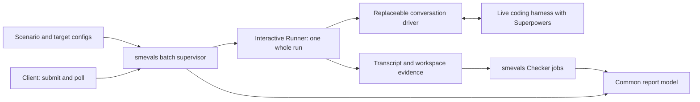

# Unified evals: proposed specification

**Status:** Parked after Drew narrowed the immediate scope on 2026-09-07.
**Participants:** Drew and Bot. **Updated:** 2026-09-07.
**Current proposed increment:** [Quorum conversation and assessment](2026-09-07-quorum-conversation-assessment-design.md).
This file retains the broader proposal as history; it is not the implementation
scope. Earlier reasoning is preserved in
[research notes](2026-09-07-unified-evals-research-notes.md).

## Historical proposal

Build one eval product in **smevals**. It schedules complete runs, invokes
checkers, and produces a common report. A replaceable interactive Runner
conducts a whole conversation with a real coding harness. Start with Gauntlet
as that Runner's conversation driver and reuse useful provisioning, fixture,
and transcript code from Superpowers Evals.

Drew has agreed to the product requirements, whole-run boundary, appliance
ownership, configuration separation, completion/grading distinction, and
capacity targets below. This draft proposes the concrete contracts, command
surface, lifecycle, packaging, and first delivery slice for review. Approval
to draft this spec does not authorize implementation, deployments, or live
spend. The next step after review is an implementation plan.

## 1. Product and scope

The product must let an author:

1. Describe scenarios in natural-ish prose, with YAML for configuration.
2. Exercise Superpowers through a live coding harness as an end user would.
3. Select any group of supported model/harness configurations.
4. Run all models and harnesses supported by Superpowers in compatible environments.
5. Receive a standardized report, including transcript and output grading.
6. Run many independent sessions concurrently within and across harness families.

An author defines the task and expected behavior, essentially none of the
exchange. The simulated user handles questions, clarification, ordinary
approvals, and task completion. A finished bad implementation, review, or
refusal is an observed outcome, not an excuse to rerun or coach the subject.

Most live execution belongs on the existing appliance, using its credentials
and Mantle/Bedrock access. Local authoring, validation, offline testing, and
report viewing remain useful. Full local live parity is not required for the
first delivery. The Linux appliance's capabilities do not limit the product's
eventual support for other environments.

Quorum is replaced as a product. There are no old workloads to preserve: no
old CLI/result compatibility, coexistence controller, campaign continuation,
or historical-result migration is required. Reuse code and scenarios where
they fit. Existing smevals API-oriented evals remain first-class users of the
same Runner/Checker boundary; they need no simulated user or coding harness.

Defer restart recovery, seals, campaign journals, statistical significance,
automatic retries/replacement samples, historical sample top-up, fleet
scheduling, and a new secret manager. Finite execution, isolation, retained
evidence, cancellation, and truthful reports are part of the core.

## 2. Architecture and ownership



| Component | Responsibility | Initial implementation |
|---|---|---|
| smevals core | Resolve tasks/configs, expand the finite matrix, schedule jobs, record runs/grades, report | Existing Python product, with execution and reporting internals corrected |
| Appliance host adapter | Detached supervisor lifetime, isolated runtimes, private auth delivery, stop/cleanup | Existing Linux host and service manager, container per live run |
| Interactive Runner | Provision fixture/harness, conduct the complete interaction, stop children, collect evidence | Bun executable in smevals, extracting useful Quorum code |
| Conversation driver | Act as the user through the prepared live harness; return when interaction concludes | Gauntlet conversation-only entrypoint |
| Harness adapter | Install/configure/launch a harness, expose interactions, identify/capture sessions | Reused adapters and normalizers behind a small per-harness interface |
| Scenario and checkers | Describe the task; evaluate behavior, transcript, and outputs | Superpowers suite in smevals; deterministic and optional model-based checkers |
| Report readers | Display the same run/grade records | CLI, JSON, Markdown first; Studio consumes the same reader |

Keep the reusable Bun worker package separate from the Superpowers scenario
suite inside the smevals repository. Gauntlet remains an independent driver
library/product. There is no language rewrite prerequisite. Quorum's entire
CLI, campaign controller, global child state, and nested scheduling do not
cross the boundary. The worker is an executable plugin, not a new service.

Each Runner invocation corresponds to one scenario × target × repetition.
The core does not see or schedule individual conversation turns. The Runner
cannot create more matrix cells. A Checker receives retained evidence and
cannot restart the subject. This leaves API-only runners and alternative live
drivers possible without changing scheduling or reporting.

## 3. Scenario authoring

Keep smevals' task/config/grader vocabulary. A **scenario** is a task using
the interactive Runner; a **target** is a named subject configuration. Authors
can put brief prose directly in task YAML or reference a Markdown file.
Fixtures and deterministic checks remain ordinary files beside the task.

Illustrative task file, with paths relative to its eval directory:

```yaml
schema_version: 1
id: code-review-catches-planted-bugs
runner: interactive
brief_file: scenarios/code-review/user.md
setup: [bun, scenarios/code-review/setup.ts]
limits:
  timeout_seconds: 1800
resources:
  class: ordinary
grader: code-review
```

`user.md` describes the task from the user's perspective:

> Ask the coding agent to review the change in this repository before merge,
> using a reviewer subagent. Answer ordinary clarification questions briefly.
> Do not identify the planted defects. End when it delivers its review and
> merge recommendation, even when that recommendation is wrong.

The setup seeds the existing two-commit fixture. It is not authored dialogue.
The corresponding grader file contains independently addressable criteria:

```yaml
schema_version: 1
id: code-review
checks:
  - id: reviewer-dispatched
    checker: transcript
    requires: [subject_transcript]
    config: {assertion: reviewer_subagent_dispatched}
  - id: review-quality
    checker: semantic
    requires: [subject_transcript, final_response, fixture_diff]
    config:
      criteria:
        - id: sql-injection
          assertion: Identify the SQL injection and its impact.
        - id: credential-handling
          assertion: Identify insecure password handling or credential logging.
        - id: merge-recommendation
          assertion: Assign appropriate severity and withhold merge approval.
```

Each criterion has a stable ID and its own result. A review can be an
artifact in the transcript; it need not be written to a separate file by the
subject. The Runner extracts a final-response artifact for convenient reading
while retaining the full source transcript.

Setup executes from the materialized eval root, with `--request` pointing to
a JSON file containing the fixture root and isolated destination workspace.
It receives no grading rubric. Exit 0 means setup finished; a nonzero exit is
an execution error at stage `setup`, before any subject launch. Reusable
prerequisite checks follow the same rule. Setup scripts may delegate to the
existing fixture helpers without retaining Quorum's CLI or environment contract.

The simulated user sees the brief and user-known facts. The private rubric,
checker implementation, and expected answers are supplied only to grading,
not to the subject or simulated user. Some facts naturally appear in both the
brief and rubric; intentional repetition is fine. The worker receives only
execution material in its subject-visible filesystem. Trusted setup code runs
before the harness starts; private checks run later in a separate workspace.

Allow optional scenario-specific exact stimuli or response constraints in the
brief. The purpose-discovery experiment requires those controls. They do not
become a mandatory persona schema, response graph, or turn DSL for other tasks.
Setup is optional for conversation-only tasks. Scenario validation checks
paths, stable IDs, checker configuration, declared evidence requirements,
limits, and capability constraints without contacting providers.

## 4. Targets, connections, and capacity

A target pins the **harness, requested model, Superpowers selection, effort,
permission mode, harness settings, and connection reference**. Harness versions
and Superpowers source refs are resolved before acceptance and recorded.
Model IDs pass through exactly; the report distinguishes the requested ID
from a model identity reported by the provider. If a harness supports only
provider/default selection, that is an explicit selection mode, never a fake
pinned model name. Malformed configurations reject submission. Valid but
unsupported scenario/target combinations receive non-runnable dispositions
while eligible cells proceed; never silently substitute model, provider, or effort.

A connection holds **protocol, endpoint/region, and an auth-source reference**.
It does not own a model, harness, or concurrency limit. Existing environment,
file, subscription/OAuth, and appliance-managed Bedrock auth sources remain
available through the adapters that support them. Credentials are materialized
privately per run from the selected sources; no new keys are implied. Never
serialize secret values or whole environments into public config snapshots.

Resource groups express **shared concurrency and launch spacing**, independently
of auth identity. Targets using the same account can share an account group;
they can also consume different model groups. Identical endpoint URLs neither
prove shared quota nor define the pool. Limits come from appliance policy,
not whichever credential happens to sort first.

Illustrative named selections derived from existing registry entries:

| Target | Role / runtime | Requested model | Connection |
|---|---|---|---|
| `claude-opus5` | Subject / Claude | `anthropic.claude-opus-5` | Mantle in `us-east-1`, existing Bedrock bearer source |
| `codex-sol` | Subject / Codex | `gpt-5.6-sol` | OpenAI Responses, existing OpenAI source |
| `user-sonnet5` | Simulated user / Gauntlet | `anthropic.claude-sonnet-5` | Existing Mantle route |
| `judge-sonnet5` | Semantic evaluator | `anthropic.claude-sonnet-5` | May use the same Mantle connection |

These are proposed first-slice choices, based on checked-in configuration,
not new live qualification claims. Gauntlet's selected model client must
support that route. Preserve separate role/configuration identities even when
user and judge use one model or auth source. Deterministic checkers need no LLM.

The eval configuration selects default `user_target: user-sonnet5` and
`judge_target: judge-sonnet5` for this example. A submission may explicitly
select different role targets; resolve those choices alongside the subject
target list and record them. Scenario prose remains model-independent.

All configs use the same target schema, whether selected by name or supplied
inline. Resolve them once into the batch request; no interacting global model
overrides. A target capability listing exposes supported harness, connection,
effort, OS, question/permission interactions, and capture coverage with reasons
for unsupported combinations. A normalizer's existence is not launch proof.
Capabilities describe protocol/runtime constraints, not a closed catalog of
model IDs. A new exact model ID can use an adapter that supports explicit model
selection; an unqualified route is labeled as such, and provider rejection is
an execution error rather than silent fallback.

The agreed capacity targets are **8 normal, qualify 16, initially 2 heavy runs
within the total**. Six concurrent sessions are demonstrated; 8 and 16 are
not. Sixteen is not a product ceiling. Preserve existing provider limits until
qualification justifies changes; a request for 8 may initially dispatch fewer.

Admission acquires all of a job's named resource groups together. A live run
reserves subject and simulated-user demand for its lifetime; if both use the
same group, count both seats. This deliberately conservative first version
avoids a per-API-call scheduler. A semantic Checker consumes its judge groups
only while running. In version one, retain live-run/provider slots through the
Runner's bounded capture and release them after the Runner and its children
are stopped. This avoids a second lifecycle handshake. Evidence publication
and grading happen afterward, with two concurrent jobs each and host CPU/memory
limits. These queues make progress independently; there is no
wait-for-the-whole-batch grading barrier. Measure capture time before adding
earlier slot release as an optimization.

Use resource-class `heavy` for full build/browser tasks. It consumes one total
run slot and one of two heavy slots. Harness-family caps are optional policy,
not a default one-session mutex. Compatible queued work may proceed when a
particular target is quota-blocked; rotate among target and grading queues to
avoid starving one arm or role. Rate-limit observations delay new admissions
for the affected group and appear in status. They do not trigger automatic
replacement runs.

## 5. Appliance submission and supervision

Proposed command surface; these commands do not exist yet:

```sh
smevals validate evals/superpowers
smevals submit evals/superpowers --appliance evals \
  --task code-review-catches-planted-bugs \
  --target claude-opus5 --target codex-sol --repeat 1 \
  --jobs 8 --deadline 2h --submission-id review-example-001
smevals status review-example-001 --appliance evals
smevals report review-example-001 --appliance evals --format markdown
smevals cancel review-example-001 --appliance evals
```

Normal submission generates an ID and saves it locally **before** sending.
An explicit ID makes the example easy to repeat. The client sends the selected
eval snapshot, target selections, repeats, limits, and grader specification.
The appliance resolves repository refs/materializes source, validates the
request, expands the finite run inventory, and persists it before accepting
responsibility. The acceptance response gives the stable batch ID and counts.
An acceptance is not a claim that execution has begun.

The same submission ID and request return the same batch. Compare the submitted
request before resolving refs again; accepted refs/configs stay frozen even
when a branch or appliance default later moves. Reusing the ID with a different
request is an error. Lost acknowledgment means query or retry the
same ID; never silently submit a new one. Polling is read-only observation.
SSH disconnects, sleeping laptops, and lost observer context do not affect
execution. Sources, configuration, and the planned inventory cannot change
under an accepted batch; a later execution requires a new submission.

Use one active finite batch per appliance initially. Reject a second with the
active ID; do not add a persistent batch queue or multi-tenant daemon. Parallelism
is within the batch's arbitrary target matrix. A detached service-manager unit
owns the batch supervisor. The supervisor alone writes lifecycle records;
workers return completion facts. Keep an immutable request, atomically replaced
status, and one run record/evidence directory per planned run. There is no
event replay or database recovery protocol.

Each live run gets a subject container with its own HOME, workspace, scratch,
tmux server, and auth projection. Its trusted Runner and simulated-user driver
run outside that container under the appliance-owned process group, with private
per-run runtime state. The driver interacts through the prepared harness adapter.
Its credentials, private user brief, control files, and result-writing authority
are outside subject-readable/writable mounts. Materialized fixtures can use
immutable shared caches, but writable homes/workspaces cannot overlap. The
subject gets only its own needed auth, not user/judge credentials, private
checks, other runs, or the host Docker socket. Native subject children/subagents
stay in its container. Cleanup owns both the trusted worker group and container.

Persist the run identity before creating its container, create with exact
batch/run ownership labels, record the container ID, then start it. This makes
an interrupted launch identifiable without adopting or restarting it. A host
ownership lock plus service identity prevents two supervisors; process identity
must include its birth identity, not merely a recycled PID.

The host adapter prepares this sandbox before invoking the Runner and passes
its scoped runtime handle in the request. The Runner provisions and launches
the subject inside that sandbox; it does not allocate an unreported container.
On return or failure, the host adapter verifies sandbox termination before
releasing the run slot. This needs no mid-run core/driver conversation protocol.

The runtime enforces a finite run deadline independently of expensive supervisor
work. The required batch deadline bounds queueing, execution, and grading.
Cancellation is durable, idempotent, and stop-only: stop admission and owned
execution/grading workers first, allow a short bounded grace, then force stop.
Collect whatever evidence is available afterward. Pending runs become
`not_started` with the reason. Do not declare cleanup done on a timeout alone;
verify owned runtimes stopped. While cleanup is uncertain, show
`cleanup_pending` and retain the host ownership lock.

Supervisor loss fails the batch. The service manager's stop hook and independent
container deadlines terminate children. Status can detect an absent supervisor
and expose an interrupted batch even when no final status was written. A
stop-only cleanup operation may stop exact labeled leftovers; it cannot adopt,
resume, or replace them. Host restart follows the same rule. A fresh batch
requires a fresh ID after cleanup. There is no restart recovery requirement.

Status includes planned/queued/running counts, runs finished, evidence/checker
work pending, results so far, resource waiting reasons, and cleanup state.
Batch `completed` means all planned dispositions and requested grading are
settled and runtimes stopped; it may contain behavioral or per-run instrument
errors. `failed` means batch supervision/publication could not finish or its
deadline expired; `cancelled` means an explicit cancellation stopped it. A
terminal outcome with `cleanup_pending` is visibly unsettled. Every planned
run still appears in the report.

The core-owned scheduling disposition is `queued | running | finished |
unsupported | not_started`. Runs admitted for launch have execution records;
cells never admitted have a disposition reason and `not_graded` rather than a
fabricated Runner result. A launch failure has disposition `finished` and an
execution error at stage `launch`; capture may be absent. Lifecycle writes use
atomic replacement; the absence of a final Runner envelope never removes a
planned row.

## 6. Executable boundary and live behavior

Runner and Checker executables share a versioned JSON-file transport:

```text
<configured argv...> --request <absolute request.json> --result <absolute result.json>
```

Invoke argv directly. Stdout/stderr are diagnostic files, not a result protocol
or an implicit answer. Private runtime paths are supplied separately from the
persisted nonsecret request snapshot. Results and referenced files must remain
inside the job's evidence directory; reject escaping paths and symlinks.

| Runner request field | Meaning |
|---|---|
| `schema_version`, `run_id` | Protocol version 1 and immutable selected-run identity |
| `scenario` | Complete execution specification: brief, setup, fixtures, stopping conditions, required evidence; no private rubric |
| `target`, optional `user_target` | Fully resolved configuration and public connection metadata |
| `runtime` | Prepared subject sandbox handle and identity for interactive appliance runs |
| `paths` | Explicit work, runtime-state, fixture, and evidence roots |
| `limits` | Finite wall deadline; optional scenario-specific interaction limit |

The core persists the resolved request before launch. The Runner prepares the
fixture, checks prerequisites, provisions the selected Superpowers/harness,
starts the prepared CLI, drives the conversation, stops all live children,
and captures evidence. The driver must not bootstrap by guessing shell commands.

Proposed driver interface: `runConversation(preparedHarness, brief, limits)`
returns a completion reason and interaction evidence. Adapt Gauntlet's existing
loop and logger, replacing grading-oriented prompts and `report_result` with
`end_interaction(reason, summary, evidence_refs)`. Merely ignoring Gauntlet's
current verdict would leave rubric-directed behavior in the experiment.

Ordinary user clarification/approval continues the conversation. A subject
turn ending is not automatically task completion. A delivered result, conclusive
refusal, or explicit scenario stopping point ends it even if the later grade
fails. No post-grade coaching. Hitting the hard deadline or interaction limit
without a scenario-defined completion produces `timed_out`, not a completed
bad answer. Record which limit ended the run.

The simulated user can interact with the prepared harness and approved views.
It cannot inspect hidden fixtures/rubrics or repair the repository directly
through Gauntlet's general shell tools. Keep native question tools enabled and
record actual options/answers. Use native structured observations when available
and TUI interaction for remaining menus/prompts. A screen viewport is not a
complete transcript. Permission mode must be explicit: the initial slice uses
permissive tool execution in isolated containers while preserving conversational
approvals and native question dialogs. Native tool-permission testing requires
an explicit target/scenario mode and remains a coverage item, not a silent claim.

The Runner's envelope separates interaction outcome from capture:

```json
{
  "schema_version": 1,
  "run_id": "review-example-001/code-review-catches-planted-bugs/claude-opus5/1",
  "execution": {"status": "completed", "reason": "review_delivered"},
  "capture": {"status": "complete"},
  "observed_target": {"harness_version": "recorded-at-launch", "model": null},
  "evidence": [
    {"kind": "subject_transcript", "path": "trajectory.json", "media_type": "application/json"},
    {"kind": "final_response", "path": "final-response.md", "media_type": "text/markdown"},
    {"kind": "fixture_diff", "path": "fixture.diff", "media_type": "text/plain"}
  ],
  "usage": {"subject": null, "user": null}
}
```

This example abbreviates the full interactive evidence bundle. Execution is
`completed | error | timed_out | cancelled`; capture is `complete | partial |
error`, with structured stage/code/message on errors. Exit 0 means the Runner
delivered a valid envelope, including any explicitly reported execution error.
Unexpected nonzero exit, missing/malformed result, or identity mismatch becomes
an execution error regardless of a claimed success. Core-enforced timeout or
cancellation is authoritative. The core records timestamps, process exit/signal,
and observed runtime identity itself. The Runner additionally reports elapsed
setup, interaction, and capture times; missing measurements remain unknown.
A missing transcript after an otherwise completed conversation is a capture
error, not subject failure.

Interactive runs provide an interaction record, final response, declared evidence
coverage, and a final workspace snapshot/diff when applicable. The first
Claude/Codex profile additionally requires native subject/subagent logs and a
normalized ATIF transcript with session/parent links. Preserve source references,
tool results, approvals, and question responses. Other adapters can supply
different transcript formats if their checkers can assess the declared criteria;
ATIF is not a universal harness-support gate. Missing capture capabilities are
explicit in preflight; required criteria cannot silently disappear. Failed
normalization retains raw evidence and a capture error. Empty final response
and absent expected output can be real subject outcomes; successful capture
must distinguish absence from failed reading. API-only runners declare their
own evidence profile through the same envelope.

Publish evidence after its writers stop, without recursively scanning mutable
workspaces in the supervision loop. Copy selected outputs and changed files,
exclude caches/dependency trees by declared capture rules, and record omissions
or truncation. Private homes/credentials are not report artifacts. Raw logs
remain restricted run evidence; default reports expose selected evidence links,
not credential files or arbitrary raw log dumps. Retention/storage failures are
visible capture/publication errors, never empty successful evidence.

## 7. Grading and the standard report

Checker requests contain `schema_version`, `run_id`, `grade_id`, `check_id`,
complete check configuration, required evidence refs, the run record, an isolated
grade workspace, and optional judge target. Original evidence is read-only.
Build/test checkers can copy outputs into their workspace and execute there.
They do not share the live subject's credentials or writable workspace.

Checker results contain the IDs and `outcome: pass | fail | error`, a reason,
evidence refs, and optional finite score/metrics. Exit 0 covers valid pass,
fail, and explicit error; nonzero, malformed output, missing required result,
or invalid score is a checker error. Scores, when present, are in [0, 1]. A
multi-criterion Checker also returns a `criteria` array keyed by the configured
criterion IDs, each with outcome, reason, and evidence refs. Missing/duplicate
IDs are errors, never omitted criteria. Single-criterion checks use the check ID.
The core derives the aggregate outcome from these records; the Checker cannot
claim a pass over a failed or missing criterion.

Default checks run independently, so a failed workflow criterion cannot hide
output quality. Explicit `depends_on` is allowed for genuine prerequisite
transforms; skipped dependent checks record the dependency and reason.

For completed executions, grade every criterion whose evidence is available,
including after partial capture. Unavailable required evidence produces a
criterion error; it never silently passes or becomes a subject failure. A
missing file proven absent by successful capture can fail a file-existence
criterion. For interrupted executions, retain partial evidence and mark normal
behavioral grading `not_graded`, reason `execution_incomplete`; those attempts
remain useful diagnostics without counting as completed behavioral samples.

Every Superpowers scenario declares transcript criteria and, when it produces
outputs, output criteria. A criterion may use both. A review or plan expressed
in chat is still an output. Files passing tests do not prove the required
workflow, and a good transcript does not prove the implementation works.
Semantic grading runs after interaction in a fresh context with the rubric and
read-only evidence. It may use the same model as the simulated user; a third
LLM or service is not mandatory.

Within a grade, any checker error or required dependency skip makes the grade
`error`; otherwise any failed criterion makes it `fail`; otherwise it is `pass`.
Retain all per-criterion outcomes even when the overall grade is error. An empty
required grader is invalid. Capture errors remain instrument errors in the
report even if available criteria all pass. Numeric scores are supplemental;
there is no implicit score aggregation or last-check-wins rule.

Regrading creates a new `grade_id` against retained evidence, saving the resolved
grader/checker versions and judge config. It never overwrites an earlier grade
or reruns the subject. A grading revision identifies the resolved grader,
checker versions, and judge configuration; a grade ID identifies one invocation.
Reports select one grading revision per scenario across all compared targets.
Rows without that revision remain visibly ungraded/differently graded and are
excluded from its behavioral summary; never fall back to an older revision.
If the same revision was invoked repeatedly, select an explicit grade ID per
run, defaulting to its latest completed invocation and showing that selection.

The common machine-readable report has one row per selected run, with:

- Scenario, target, repetition, run ID, source/Superpowers/driver/harness identities,
  requested/effective settings, and whether the combination was supported.
- Execution status and reason; capture status; grade revision/status; every
  criterion's outcome and evidence references.
- Queue, setup, interaction, capture, and grading times, plus total elapsed time.
- Subject/user/judge usage and cost separately; missing usage/cost as unknown,
  with coverage counts rather than a misleading zero total.
- Artifact references and any cleanup or batch-level error.

Illustrative rows, not results of new runs:

| Target | Execution | Capture | Grade | Evidence / meaning |
|---|---|---|---|---|
| Claude / Opus 5 | completed | complete | fail | Review delivered but missed injection |
| Codex / Sol | completed | complete | pass | Review and subagent evidence satisfy criteria |
| Another repetition | completed | partial | error | Reviewer session missing; review-text criterion still recorded |
| Another repetition | timed_out | partial | not_graded | Partial transcript retained; runtime stopped |

CLI, JSON, Markdown, and Studio use this same report model. Include every
selected target and repetition: errors, cancellations, unsupported combinations,
and runs never started. Preflight reports unsupported cells and submits the
eligible inventory with those dispositions retained; if none are eligible,
reject execution with the complete validation report. No successful-sample top-up.

Summaries show pass/fail among fully assessable completed runs, counts of
instrument errors/incomplete runs, and the total selected denominator alongside
that breakdown. A report must not imply an error is a behavioral fail or hide
it by choosing the busiest configuration. Reports are available incrementally;
completion adds settled totals rather than requiring bespoke analysis.

## 8. First delivery and proof

Deliver a working vertical slice in smevals before porting the entire suite:

| Existing scenario | What it exercises | Required grading |
|---|---|---|
| `brainstorming-todo-purpose-discovery` | Real clarification/approval and saved design/plan; stop at first implementation activity | Purpose elicitation/reflection, document contents, approval/order evidence |
| `code-review-catches-planted-bugs` | Reviewer subagent and a delivered review, including a bad one | Actual defects/severity/merge recommendation plus dispatch/transcript evidence |
| `sdd-go-fractals-opus48` | Subagent implementation/reviews, real build/tests, delivery | Role/sequence evidence, working CLI/tests, outputs delivered to launch checkout |

Run all three on Claude and Codex using one pinned Superpowers revision. The
Go scenario's suffix identifies the fixture-plan author, not a required subject
model. The purpose scenario is explicitly selected despite its current adhoc
tier. Preserve its controlled replies and 25-minute cutoff. The review example
uses 30 minutes; propose a 120-minute Go attempt limit based on the observed
long tail. These limits become resolved task inputs, not global defaults.

The first proof must show:

1. One simple prose scenario drives a real conversation on each harness, including
   a native question and conversational approval where the scenario calls for it.
2. Transcript, subagent, and output grading work; completed incorrect outcomes
   remain completed failures. Offline fault fixtures separately prove execution,
   capture, checker, missing-output, timeout, and cancellation attribution.
3. Multiple simultaneous runs of the same harness and mixed harnesses have
   isolated homes/sessions/workspaces. Resource groups cap actual admission,
   including the shared simulated-user route.
4. Appliance submission survives client disconnection. A new client can poll,
   retrieve the report, and cancel by the same ID. Lost acknowledgment does not
   duplicate work; supervisor loss terminates children and remains visible.
5. Slow capture/checking does not stop dispatch or delay cancellation. Fake long
   jobs exercise deadlines/cleanup without buying live failures. Regrading uses
   retained evidence and preserves earlier grades.
6. Every selected cell appears consistently in CLI/JSON/Markdown, including
   ungraded and errored cells, with no automatic replacement samples.

Then qualify ordinary live load at 8, and 16, with at most 2 heavy attempts
inside the total. Use a fixed scenario/target mix and fresh measured attempts
at each level; report wall throughput, queue/resource waits, interaction time,
error/429 rates, resource peaks, and usage coverage from the standard records.
Compare equivalent workload mixes; do not claim a speedup from unrelated old
campaigns. The target is useful concurrency with stable behavior/evidence,
not merely sixteen containers existing at once. Keep the highest demonstrated
safe operating setting; qualification may show a provider rather than host
limit. Define the paid sample count/cost ceiling in the later run plan.

After the first slice, add remaining supported Superpowers harnesses/providers
through the same adapter/capability contract and qualify each. Browser-heavy
scenarios and non-Linux harness paths remain explicit coverage work. Claude and
Codex are the first slice, not fulfillment of the all-harness requirement.

## 9. Why these choices

The inspected appliance supports headroom on ordinary workloads, but the
refactor has not established the agreed higher capacity. On September 4,
150 runs occupied six concurrent slots for most of 121 minutes while host load
stayed low. Another cohort suffered artifact-scan contention despite abundant
memory; a later cohort stopped on stale telemetry. That supports separating
supervision from evidence work and removing telemetry freshness as an execution
ownership condition. It does not establish that every workload is cheap.

Across 743 retained verdicts, Go fractals represented about 4.3% of rows and
23.2% of run-hours. This supports a small heavy-task cap. Existing simulated-user
routes have configured caps of two or six; removing post-run grading from the
conversation does not remove that live user-model demand. Provider ceilings
were not independently queried in the audit.

smevals supplies the right product concepts and executable extension boundary.
Its inspected implementations lose structured runner configuration, exclude
nonzero runs from grading/reporting, replace missing successful samples, and
blur checker crashes with behavioral failure. Those are changes to make in the
single core, not reasons to layer Quorum underneath it. Reusable-runner, concurrency,
and Studio branches contain useful work; none is adopted wholesale as a second
execution or report implementation.

Gauntlet supplies a real interaction loop and isolated TUI tools, but currently
mixes simulated-user behavior with self-grading. Its conversation-only seam is
required work. claude-session-driver offers useful native observations, but its
current Claude defaults disable native questions and bypass permissions; it is
not a drop-in driver for this contract. Neither component dictates the design.

Pinned source and longer reasoning are in the
[research record](2026-09-07-unified-evals-research-notes.md#evidence-and-history-pointers).
The [capacity readout](/Users/drewritter/.codex/visualizations/2026/09/07/01a07cbc-47f5-70d0-803e-acdaff77da82/evals-capacity/READOUT.md)
contains the sanitized host/run inventory and limitations. It is local discussion
evidence, not a portable runtime dependency. Recheck mutable host/provider facts
before implementation claims or any authorized live qualification.
